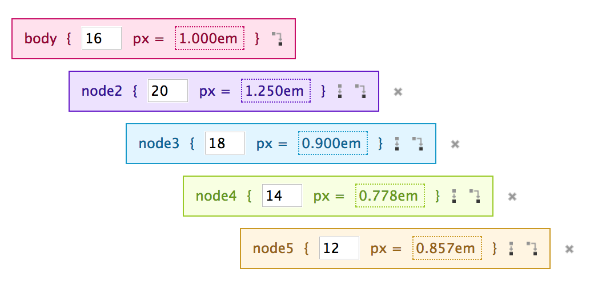

## em&rem

`rem`和`em`很容易混淆，其实两个都是`css`的单位，并且也都是相对单位，现有的`em`，`css3`才引入的`rem`，在介绍`rem`之前，我们先来了解下`em`

#### em

> `em`作为`font-size`的单位时，其代表父元素的字体大小，`em`作为其他属性单位时，代表自身字体大小 —— `MDN`

`em`可以让我们的页面更灵活，更健壮，比起到处写死的`px`值，`em`似乎更有张力，改动父元素的字体大小，子元素会等比例变化，这一变化似乎预示了无限可能



有些人提出用`em`来做弹性布局页面，但其复杂的计算让人诟病，`o`(╯□╰)`o`。

`em`做弹性布局的缺点还在于牵一发而动全身，一旦某个节点的字体大小发生变化，那么其后代元素都得重新计算，`X`﹏`X`。

#### rem

`rem` 指的是相对与 `html` 元素的字体大小。

`rem`取值分为两种情况，设置在根元素时和非根元素时，举个例子：

```css
/* 作用于根元素，相对于原始大小（16px），所以html的font-size为32px*/
html {font-size: 2rem}

/* 作用于非根元素，相对于根元素字体大小，所以为64px */
p {font-size: 2rem}
```

我一直觉得`em`就是为字体和行高而生的，有些时候子元素字体就应该相对于父元素，元素行高就应该相对于字体大小；而`rem`的有点在于统一的参考系。

#### rem布局原理

`rem`布局的本质是什么？这是我问过很多人的一个问题，但得到的回答都差强人意，其实`rem`布局的本质是等比缩放，一般是基于宽度，试想一下如果`UE`图能够等比缩放，那该多么美好啊。

假设我们将屏幕宽度平均分成`100`份，每一份的宽度用`x`表示，`x =屏幕宽度 / 100`，如果将`x`作为单位，`x`前面的数值就代表屏幕宽度的百分比

```css
p {width: 50x} /* 屏幕宽度的50% */
```

如果想要页面元素随着屏幕宽度等比变化，我们需要上面的`x`单位，不幸的是`css`中并没有这样的单位，幸运的是在`css`中有`rem`，通过`rem`这个桥梁，可以实现神奇的`x`。

通过上面对`rem`的介绍，可以发现，如果子元素设置`rem`单位的属性，通过更改`html`元素的字体大小，就可以让子元素实际大小发生变化

```Css
html {font-size: 16px}
p {width: 2rem} /* 32px*/

html {font-size: 32px}
p {width: 2rem} /*64px*/
```

如果让`html`元素字体的大小，恒等于屏幕宽度的`1/100`，那`1rem`和`1x`就等价了

```css
html {fons-size: width / 100}
p {width: 50rem} /* 50rem = 50x = 屏幕宽度的50% */
```

如何让`html`字体大小一直等于屏幕宽度的百分之一呢？ 可以通过`js`来设置，一般需要在页面`dom ready`、`resize`和屏幕旋转中设置

```js
document.documentElement.style.fontSize = document.documentElement.clientWidth / 100 + 'px';
```

那么如何把UE图中的获取的像素单位的值，转换为已rem为单位的值呢？公式是`元素宽度 / UE图宽度 * 100`，让我们举个例子，假设UE图尺寸是640px，UE图中的一个元素宽度是100px，根据公式`100/640*100 = 15.625`

```css
p {width: 15.625rem}
```

下面来验证下上面的计算是否正确，下面的表格是`UE`图等比缩放下，元素的宽度

| UE图宽度 | UE图中元素宽度 |
| :------- | :------------- |
| 640px    | 100px          |
| 480px    | 75px           |
| 320px    | 50px           |

下面的表格是通过我们的元素在不同屏幕宽度下的计算值

| 页面宽度 | html字体大小    | p元素宽度        |
| :------- | :-------------- | :--------------- |
| 640px    | 640/100 = 6.4px | 15.625*6.4=100px |
| 480px    | 480/100=4.8px   | 15.625*4.8=75px  |
| 320px    | 320/100=3.2px   | 15.625*3.2=50px  |

可以发现，UE图宽度和屏幕宽度相同时，两边得出的元素宽度是一致的

上面的计算过程有些繁琐，可以通过预处理的`function`来简化过程，下面是`sass`的例子，`less`类似

```scss
$ue-width: 640; /* ue图的宽度 */

@function px2rem($px) {
  @return #{$px/$ue-width*100}rem;
}

p {
  width: px2rem(100);
}
```

上面的代码编译完的结果如下

```css
p {width: 15.625rem}
```

其实有了postcss后，这个过程应该放到postcss中，源代码如下

```css
p {width: 100px2rem}
```

postcss会对px2rem这个单位进行处理，处理后的结果如下，感兴趣的话来写一个px2rem的postcss插件吧

```css
p {width: 15.625rem}
```

## vw&vh

上面提到想让页面元素随着页面宽度变化，需要一个新的单位`x`，`x`等于屏幕宽度的百分之一，`css3`带来了`rem`的同时，也带来了`vw`和`vh`

> `vw` —— 视口宽度的 `1/100`；`vh` —— 视口高度的 `1/100` —— `MDN`

聪明的你也许一经发现，这不就是单位`x`吗，没错根据定义可以发现`1vw=1x`，有了`vw`我们完全可以绕过`rem`这个中介了，下面两种方案是等价的，可以看到`vw`比`rem`更简单，毕竟`rem`是为了实现`vw`么

```css
/* rem方案 */
html {fons-size: width / 100}
p {width: 15.625rem}

/* vw方案 */
p {width: 15.625vw}
```

`vw`还可以和`rem`方案结合，这样计算`html`字体大小就不需要用`js`了

```css
html {fons-size: 1vw} /* 1vw = width / 100 */
p {width: 15.625rem}
```