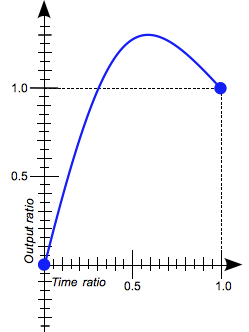

# transation

`CSS transitions` 提供了一种在更改`CSS`属性时控制动画速度的方法。 其可以让属性变化成为一个持续一段时间的过程，而不是立即生效的。比如，将一个元素的颜色从白色改为黑色，通常这个改变是立即生效的，使用 `CSS transitions` 后该元素的颜色将逐渐从白色变为黑色，按照一定的曲线速率变化。这个过程可以自定义。

通常将两个状态之间的过渡称为**隐式过渡（implicit transitions）**，因为开始与结束之间的状态由浏览器决定。


该属性可以决定哪些属性发生动画效果 (明确地列出这些属性)，何时开始 (设置 `delay`），持续多久 (设置` duration`) 以及如何动画 (定义`timing function`，比如匀速地或先快后慢)。

## 定义过渡

[`transition-property`](https://developer.mozilla.org/zh-CN/docs/Web/CSS/transition-property)

指定哪个或哪些 CSS 属性用于过渡。只有指定的属性才会在过渡中发生动画，其它属性仍如通常那样瞬间变化。

```css
transition-property: opacity, left, top, height;
```

[`transition-duration`](https://developer.mozilla.org/zh-CN/docs/Web/CSS/transition-duration)

指定过渡的时长。或者为所有属性指定一个值，或者指定多个值，为每个属性指定不同的时长。

```css
transition-duration: 0.5s
```

[`transition-delay`](https://developer.mozilla.org/zh-CN/docs/Web/CSS/transition-delay)

指定延迟，即属性开始变化时与过渡开始发生时之间的时长。

```css
transition-delay: 0.5s
```

[`transition-timing-function`](https://developer.mozilla.org/zh-CN/docs/Web/CSS/transition-timing-function)

指定一个函数，定义属性值怎么变化。缓动函数 `Timing functions` 定义属性如何计算。多数 `timing functions` 由四点定义一个 `bezier` 曲线。也可以从 `Easing Functions Cheat Sheet` 选择缓动效果。



```css
transition-timing-function: ease
```

<iframe class="live-sample-frame sample-code-frame" frameborder="0" height="150" id="frame_ttf_ease" src="https://mdn.mozillademos.org/zh-CN/docs/Web/CSS/CSS_Transitions/Using_CSS_transitions$samples/ttf_ease?revision=1584028" width="275" style="margin: 0px; padding: 20px; border-width: 1px 1px 1px 5px; border-style: solid; border-color: rgb(61, 126, 154); border-image: initial; max-width: calc((100% - 40px) - 6px); width: calc((100% - 40px) - 6px);"></iframe>

```css
transition-timing-function: linear
```

<iframe class="live-sample-frame sample-code-frame" frameborder="0" height="150" id="frame_ttf_linear" src="https://mdn.mozillademos.org/zh-CN/docs/Web/CSS/CSS_Transitions/Using_CSS_transitions$samples/ttf_linear?revision=1584028" width="275" style="margin: 0px; padding: 20px; border-width: 1px 1px 1px 5px; border-style: solid; border-color: rgb(61, 126, 154); border-image: initial; max-width: calc((100% - 40px) - 6px); width: calc((100% - 40px) - 6px);"></iframe>

```css
nsition-timing-function: step-end
```

<iframe class="live-sample-frame sample-code-frame" frameborder="0" height="150" id="frame_ttf_stepend" src="https://mdn.mozillademos.org/zh-CN/docs/Web/CSS/CSS_Transitions/Using_CSS_transitions$samples/ttf_stepend?revision=1584028" width="275" style="margin: 0px; padding: 20px; border-width: 1px 1px 1px 5px; border-style: solid; border-color: rgb(61, 126, 154); border-image: initial; max-width: calc((100% - 40px) - 6px); width: calc((100% - 40px) - 6px);"></iframe>

```css
transition-timing-function: steps(4, end)
```

<iframe class="live-sample-frame sample-code-frame" frameborder="0" height="150" id="frame_ttf_step4end" src="https://mdn.mozillademos.org/zh-CN/docs/Web/CSS/CSS_Transitions/Using_CSS_transitions$samples/ttf_step4end?revision=1584028" width="275" style="margin: 0px; padding: 20px; border-width: 1px 1px 1px 5px; border-style: solid; border-color: rgb(61, 126, 154); border-image: initial; max-width: calc((100% - 40px) - 6px); width: calc((100% - 40px) - 6px);"></iframe>

## transition 属性

#### 全写

```css
transition: <property> <duration> <timing-function> <delay>;
```

多属性动画指定：

```css
transition: 5s height ease 1s, 1s background ease 1s;
```

#### 分写

以 [`transition-property`](https://developer.mozilla.org/zh-CN/docs/Web/CSS/transition-property) 的值列表长度为标准，如果某个属性值列表长度短于它的，则重复其值以长度一致， 例如:

```css
div {
  transition-property: opacity, left, top, height;
  transition-duration: 3s, 5s;
}
```

将按下面这样处理:

```css
div {
  transition-property: opacity, left, top, height;
  transition-duration: 3s, 5s, 3s, 5s;
```

## 检测过渡是否完成

当过渡完成时触发一个事件，在符合标准的浏览器下，这个事件是 `transitionend`,  `transitionend 事件提供两个属性`:

- `propertyName`

  字符串，指示已完成过渡的属性。

- `elapsedTime`

  浮点数，指示当触发这个事件时过渡已运行的时间（秒）。这个值不受 [`transition-delay`](https://developer.mozilla.org/zh-CN/docs/Web/CSS/transition-delay) 影响。

照例可以用  [`element.addEventListener()`](https://developer.mozilla.org/zh-CN/docs/Web/API/Element/addEventListener) 方法来监听这个事件：

```js
el.addEventListener("transitionend", updateTransition, true);
```

**Note:** 如果取消了过渡则不会触发 `transitionend` 事件，因为在过渡完成前动画的属性值改变了。

## work with javascript

`transition` 是非常好的工具，可以让 `JavaScript` 效果平滑而不用修改 `JavaScript`。 看下面例子：

```html
<body>
    <div></div>    
    <style>
        div{
            width: 100px;
            height: 100px;
            /* transition: 1s all ease; */
            transition: 5s height ease,1s background ease;
            /* transition: 1s all ease-in; */
            /* transition: 1s all ease-out; */
            /* transition: 1s all ease-in out; */
            /* background: linear-gradient(mediumturquoise,mediumslateblue); */
            background: red;
        }
        div:active{
            height: 300px;
            /* background: linear-gradient(mediumslateblue,mediumseagreen); */
            background: yellow;
        }
    </style>
    <script>
        document.getElementsByTagName("div")[0].onclick = function(){
            this.style.width = "1000px"
        }
    </script>
</body>
```

