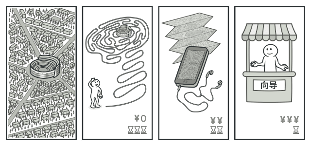

# 迭代器模式 `Iterator`

**迭代器模式**是一种行为设计模式， 让你能在不暴露集合底层表现形式 （列表、 栈和树等） 的情况下遍历集合中所有的元素。

## 问题

集合是编程中最常使用的数据类型之一。 尽管如此， 集合只是一组对象的容器而已。

大部分集合使用简单列表存储元素。 但有些集合还会使用栈、 树、 图和其他复杂的数据结构。

无论集合的构成方式如何， 它都必须提供某种访问元素的方式， 便于其他代码使用其中的元素。 集合应提供一种能够遍历元素的方式， 且保证它不会周而复始地访问同一个元素。

如果你的集合基于列表， 那么这项工作听上去仿佛很简单。 但如何遍历复杂数据结构 （例如树） 中的元素呢？ 例如， 今天你需要使用深度优先算法来遍历树结构， 明天可能会需要广度优先算法； 下周则可能会需要其他方式 （比如随机存取树中的元素）。

不断向集合中添加遍历算法会模糊其 “高效存储数据” 的主要职责。 此外， 有些算法可能是根据特定应用订制的， 将其加入泛型集合类中会显得非常奇怪。

另一方面， 使用多种集合的客户端代码可能并不关心存储数据的方式。 不过由于集合提供不同的元素访问方式， 你的代码将不得不与特定集合类进行耦合。

## 解决方案

迭代器模式的主要思想是将集合的遍历行为抽取为单独的*迭代器*对象。

除实现自身算法外， 迭代器还封装了遍历操作的所有细节， 例如当前位置和末尾剩余元素的数量。 因此， 多个迭代器可以在相互独立的情况下同时访问集合。

迭代器通常会提供一个获取集合元素的基本方法。 客户端可不断调用该方法直至它不返回任何内容， 这意味着迭代器已经遍历了所有元素。

所有迭代器必须实现相同的接口。 这样一来， 只要有合适的迭代器， 客户端代码就能兼容任何类型的集合或遍历算法。 如果你需要采用特殊方式来遍历集合， 只需创建一个新的迭代器类即可， 无需对集合或客户端进行修改。

## 真实世界类比

你计划在罗马游览数天， 参观所有主要的旅游景点。 但在到达目的地后， 你可能会浪费很多时间绕圈子， 甚至找不到罗马斗兽场在哪里。

或者你可以购买一款智能手机上的虚拟导游程序。 这款程序非常智能而且价格不贵， 你想在景点待多久都可以。

第三种选择是用部分旅行预算雇佣一位对城市了如指掌的当地向导。 向导能根据你的喜好来安排行程， 为你介绍每个景点并讲述许多激动人心的故事。 这样的旅行可能会更有趣， 但所需费用也会更高。

所有这些选择(自由漫步、 智能手机导航或真人向导)都是这个由众多罗马景点组成的集合的迭代器。

## 迭代器模式结构

#### 迭代器接口 `Iterator`

 `Iterator`接口声明了遍历集合所需的操作： 获取下一个元素、 获取当前位置和重新开始迭代等。

#### 迭代器实现者 `Concrete Iterator`

 实现遍历集合的一种特定算法，每个迭代器的实现者都拥有集合快照，同时迭代器对象必须跟踪自身遍历的进度。 这使得多个迭代器可以相互独立地遍历同一集合。

#### 集合接口 `Collection`

集合接口声明一个或多个方法来获取与集合兼容的迭代器。 请注意， 返回方法的类型必须被声明为迭代器接口， 因此具体集合可以返回各种不同种类的迭代器。

#### 具体集合 `Concrete Collections`

具体集合会在客户端请求迭代器时返回一个特定的具体迭代器类实体。 你可能会琢磨， 剩下的集合代码在什么地方呢？ 不用担心， 它也会在同一个类中。 只是这些细节对于实际模式来说并不重要， 所以我们将其省略了而已。

#### 客户端 `Client`

通过集合和迭代器的接口与两者进行交互。 这样一来客户端无需与具体类进行耦合， 允许同一客户端代码使用各种不同的集合和迭代器。

客户端通常不会自行创建迭代器， 而是会从集合中获取。 但在特定情况下， 客户端可以直接创建一个迭代器 （例如当客户端需要自定义特殊迭代器时）。

## 伪代码

在本例中，**迭代器**模式用于遍历一个封装了访问微信好友关系功能的特殊集合。 该集合提供使用不同方式遍历档案资料的多个迭代器。

