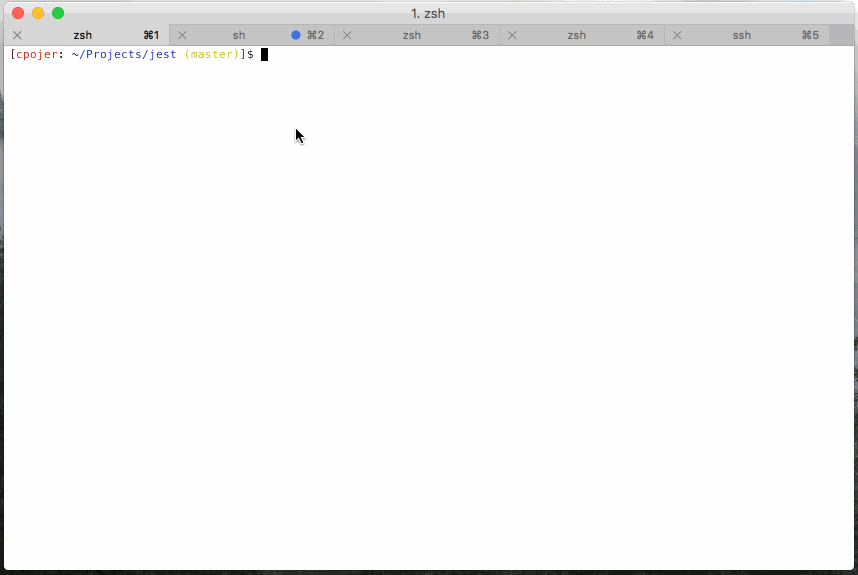
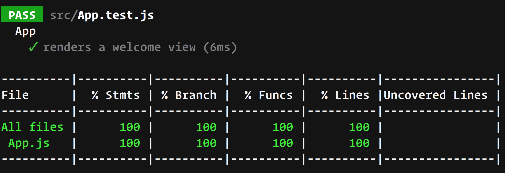

# React test with Jest


## 测试原理

`Create React App`程序使用`Jest`作为测试运行器，`jest`本身是一款基于`node`的通用测试框架，虽然`Jest`中可以使用`jsdom`提供了诸如`window`之类的浏览器全局变量，但它们只是与真正的浏览器行为相近似，所以`Jest`旨在用于逻辑和组件的单元测试，而不是`DOM`测试。在`react`中使用`JSX`编译或者直接使用`React.createElement()` 声明的组件，实际上创建的是类似这样的一个`React Dom`对象：

```js
// 注意：这是简化过的结构
const element = {
  type: 'h1',
  props: {
    className: 'greeting',
    children: 'Hello, world!'
  }
};
```

也就是说`jest`在对`react`进行测试的时候实际上是对`react dom`对象进行结构化测试，

##  文件名的约定

`Jest`将查找具有下列任何一种命名约定的测试文件：

- `__tests__`文件夹中带有.js后缀的文件。
- 带`.test.js`后缀的文件。
- 带`.spec.js`后缀的文件

##  命令行接口

当您运行`npm test`时，`Jest`将以监视所有测试文件模式启动。每次保存文件时，它都会重新运行测试。



## 编写测试代码

要创建测试，添加带有测试名称及其代码的`it()`或`test()`块。您可以选择将它们包装在`describe()`块中进行逻辑分组，但这既不是必需的，也不建议这样做。

`Jest`提供了一个内置的`expect()`全局函数来生成断言。一个基本的测试看起来是这样的：

```js
import sum from './sum';

it('sums numbers', () => {
  expect(sum(1, 2)).toEqual(3);
  expect(sum(2, 2)).toEqual(4);
});
```

`Jest`支持的所有`expect()`匹配器在这里有详细的文档说明。您还可以使用`jest.fn()`和``.toHaveBeenCalled()``进行函数回调测试。

```js
function callback(fn) {
    fn()
}

let callbackFunc = jest.fn()

test('test callback', () => {
    callback(callbackFunc)
    expect(callbackFunc).toHaveBeenCalled()
})
```

## 组件测试

目前有很多种组件测试技术，比如验证组件在不抛出错误的情况下正常渲染的`冒烟测试`、完全渲染和测试组件生命周期和状态变化、栈渲染、输出测试。

如果你还没有决定一个测试策略，我们建议你开始为你的组件创建基本`冒烟测试`：

```js
import React from 'react';
import ReactDOM from 'react-dom';
import App from './App';

it('renders without crashing', () => {
  const div = document.createElement('div');
  ReactDOM.render(<App />, div);
});
```

此测试仅仅是将渲染组件，并确保在渲染过程中不会抛出错误。 像这样的测试只需很少的努力就可以提供很多价值。

#### React Testing Library & jest-dom 断言库

`react-testing-library`是一个用于测试反应组件的库，其方式类似于最终用户使用组件的方式。它非常适合于`React`组件和应用程序的单元、集成和端到端测试。它更直接地使用`DOM`节点，因此建议与`jest-dom`一起使用，以改进断言。

```bash
npm install --save @testing-library/react @types/testing-library__dom @testing-library/jest-dom 
```

> **注意：**`test-library-react`是基于`test-library-dom`的，而`test-library-dom`本身不提供`index.d.ts`所以说我们需要额外引入一个@type文件。

通过创建一个`src/setupTests.js`文件并且导入，你就可以避免在你的测试文件中多次声明，而是直接将额外的断言加入到你的测试库中。

```js
// react-testing-library renders your components to document.body,
// this adds jest-dom's custom assertions
import '@testing-library/jest-dom/extend-expect';
```

这是一个使用`react-testing-library`和`jest-dom`测试`<App />`组件呈现` Welcome to React`的示例。

```js
import React from 'react';
import { render } from '@testing-library/react';
import App from './App';

it('renders welcome message', () => {
  const { getByText } = render(<App />);
  expect(getByText('Learn React')).toBeInTheDocument();
});
```

## 代码覆盖率

`Jest`有一个集成的代码覆盖率测试器，它在`ES6`上工作得很好，不需要配置。运行`npm test -- --coverage`。



注意，在覆盖范围下，测试运行速度会慢得多，因此建议将其与正常工作流程分开运行。