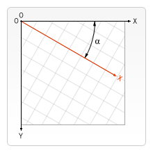

在本教程前面的部分中，我们已经了解了Canvas网格和坐标空间。到目前为止，我们只是根据我们的需要使用默认的网格，改变整个画布的大小。变形是一种更强大的方法，可以将原点移动到另一点、对网格进行旋转和缩放。

## 状态的保存和恢复 Saving and restoring state

在了解变形之前，我先介绍两个在你开始绘制复杂图形时必不可少的方法。

- [`save()`](https://developer.mozilla.org/zh-CN/docs/Web/API/CanvasRenderingContext2D/save)

  保存画布`(canvas)`的所有状态

- [`restore()`](https://developer.mozilla.org/zh-CN/docs/Web/API/CanvasRenderingContext2D/restore)

  `save` 和` restore `方法是用来保存和恢复 `canvas `状态的，都没有参数。`Canvas `的状态就是当前画面应用的所有样式和变形的一个快照。

`Canvas`状态存储在栈中，每当`save()`方法被调用后，当前的状态就被推送到栈中保存。一个绘画状态包括：

- 当前应用的变形（即移动，旋转和缩放，见下）
- 以及下面这些属性：[`strokeStyle`](https://developer.mozilla.org/zh-CN/docs/Web/API/CanvasRenderingContext2D/strokeStyle), [`fillStyle`](https://developer.mozilla.org/zh-CN/docs/Web/API/CanvasRenderingContext2D/fillStyle), [`globalAlpha`](https://developer.mozilla.org/zh-CN/docs/Web/API/CanvasRenderingContext2D/globalAlpha), [`lineWidth`](https://developer.mozilla.org/zh-CN/docs/Web/API/CanvasRenderingContext2D/lineWidth), [`lineCap`](https://developer.mozilla.org/zh-CN/docs/Web/API/CanvasRenderingContext2D/lineCap), [`lineJoin`](https://developer.mozilla.org/zh-CN/docs/Web/API/CanvasRenderingContext2D/lineJoin), [`miterLimit`](https://developer.mozilla.org/zh-CN/docs/Web/API/CanvasRenderingContext2D/miterLimit), [`lineDashOffset`](https://developer.mozilla.org/zh-CN/docs/Web/API/CanvasRenderingContext2D/lineDashOffset), [`shadowOffsetX`](https://developer.mozilla.org/zh-CN/docs/Web/API/CanvasRenderingContext2D/shadowOffsetX), [`shadowOffsetY`](https://developer.mozilla.org/zh-CN/docs/Web/API/CanvasRenderingContext2D/shadowOffsetY), [`shadowBlur`](https://developer.mozilla.org/zh-CN/docs/Web/API/CanvasRenderingContext2D/shadowBlur), [`shadowColor`](https://developer.mozilla.org/zh-CN/docs/Web/API/CanvasRenderingContext2D/shadowColor), [`globalCompositeOperation`](https://developer.mozilla.org/zh-CN/docs/Web/API/CanvasRenderingContext2D/globalCompositeOperation), [`font`](https://developer.mozilla.org/zh-CN/docs/Web/API/CanvasRenderingContext2D/font), [`textAlign`](https://developer.mozilla.org/zh-CN/docs/Web/API/CanvasRenderingContext2D/textAlign), [`textBaseline`](https://developer.mozilla.org/zh-CN/docs/Web/API/CanvasRenderingContext2D/textBaseline), [`direction`](https://developer.mozilla.org/zh-CN/docs/Web/API/CanvasRenderingContext2D/direction), [`imageSmoothingEnabled`](https://developer.mozilla.org/zh-CN/docs/Web/API/CanvasRenderingContext2D/imageSmoothingEnabled)

你可以调用任意多次 `save`方法。每一次调用 `restore` 方法，上一个保存的状态就从栈中弹出，所有设定都恢复。

```js
function draw() {
  var ctx = document.getElementById('canvas').getContext('2d');

  ctx.fillRect(0,0,150,150);   // 使用默认设置绘制一个矩形
  ctx.save();                  // 保存默认状态

  ctx.fillStyle = '#09F'       // 在原有配置基础上对颜色做改变
  ctx.fillRect(15,15,120,120); // 使用新的设置绘制一个矩形

  ctx.save();                  // 保存当前状态
  ctx.fillStyle = '#FFF'       // 再次改变颜色配置
  ctx.globalAlpha = 0.5;    
  ctx.fillRect(30,30,90,90);   // 使用新的配置绘制一个矩形

  ctx.restore();               // 重新加载之前的颜色状态
  ctx.fillRect(45,45,60,60);   // 使用上一次的配置绘制一个矩形

  ctx.restore();               // 加载默认颜色配置
  ctx.fillRect(60,60,30,30);   // 使用加载的配置绘制一个矩形
}
```

|                          Screenshot                          |
| :----------------------------------------------------------: |
|  |

## 移动 Translating

我们先介绍 `translate `方法，它用来移动 canvas 和它的原点到一个不同的位置。

- `translate(x, y)`

  `translate `方法接受两个参数。x 是左右偏移量，y 是上下偏移量，如右图所示。

  

在做变形之前先保存状态是一个良好的习惯。大多数情况下，调用 restore 方法比手动恢复原先的状态要简单得多。又，如果你是在一个循环中做位移但没有保存和恢复 canvas 的状态，很可能到最后会发现怎么有些东西不见了，那是因为它很可能已经超出 canvas 范围以外了。

```js
function draw() {
  var ctx = document.getElementById('canvas').getContext('2d');
  for (var i = 0; i < 3; i++) {
    for (var j = 0; j < 3; j++) {
      ctx.save();
      ctx.fillStyle = 'rgb(' + (51 * i) + ', ' + (255 - 51 * i) + ', 255)';
      
      ctx.translate(10 + j * 50, 10 + i * 50);
      ctx.fillRect(0, 0, 25, 25);
      ctx.restore();
    }
  }
}
```

|                          Screenshot                          |
| :----------------------------------------------------------: |
|  |

## 旋转 Rotating



第二个介绍 `rotate `方法，它用于以原点为中心旋转 canvas。

- `rotate(angle)`

  这个方法只接受一个参数：旋转的角度(angle)，它是顺时针方向的，以弧度为单位的值。

旋转的中心点始终是 canvas 的原点，如果要改变它，我们需要用到 `translate `方法。

