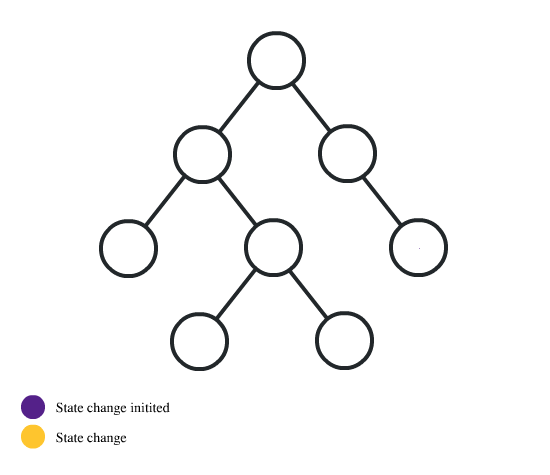
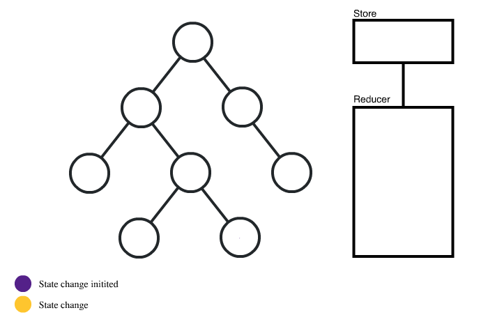
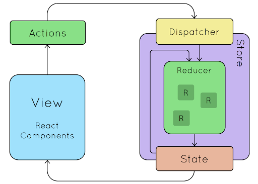
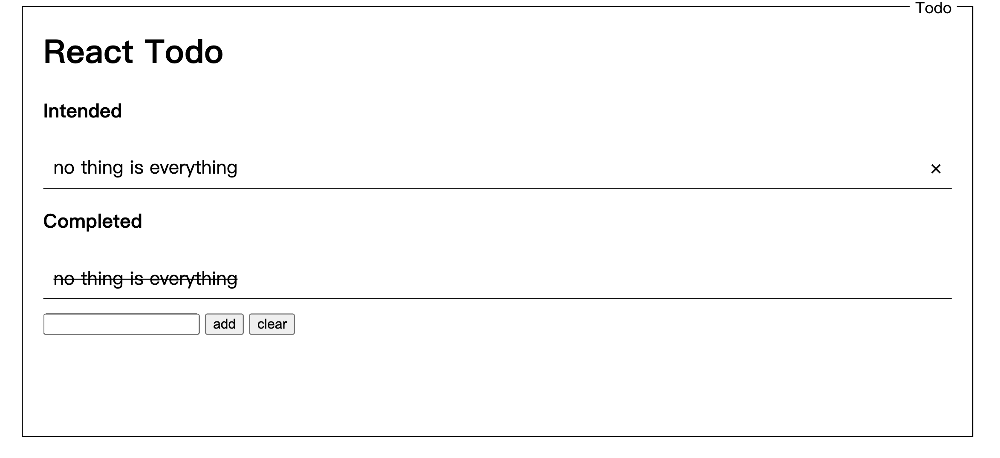
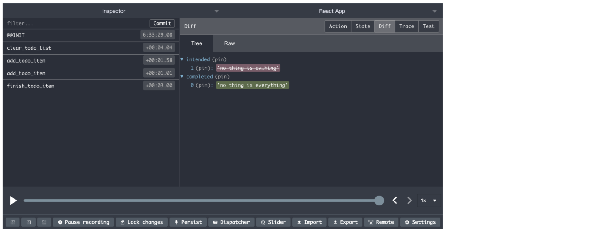

## Movtivation

通常我们要对组件的状态进行更新的时候，我们需要一层一层通过事件回调把数据传递到顶层组件，这要繁琐的过程在构建大型的`PWA(单页应用)`的时候显然是不可取的，而`redux`则是`react`所需要的状态管理器，当然`Redux`不知局限与`React`。



## Redux

`redux`改变的只是`react`管理状态（数据）的方式，并不改变数据的传递方式，也就是说数据仍然是自上而下的传递，而我们可以在子组件中通过`redux`直接改变`state`，最后`store`会将新数据响应给订阅他的组件并且传递下去。



## Install

安装稳定版：

```shell
npm install --save redux
```

#### other packages

多数情况下，你还需要使用 [React 绑定库](http://github.com/gaearon/react-redux)和[开发者工具](http://github.com/gaearon/redux-devtools)。

```shell
npm install --save react-redux
npm install --save-dev redux-devtools
```

## Working Flow

使用`redux`构建起的单页应用的工作流一般如下图所示，用户的操作在`view(视图层)`通过`ActionCreater(动作生成器)`获取`Action(动作)`，并且到`reducer`中获取应该改变之后的状态，并且`dispatcher`会对`store储存的数据`进行更新，最后如果组件进行了数据的监听，数据的更新就会响应到视图上面。



## Example

让我们通过一个实际的todo应用来体会一下这个过程，实现的效果大概是这样的：



## Action

首先，让我们来给 action 下个定义。**Action** 是把数据从应用传到 store 的有效载荷，它用来告诉store用事情发生并且描述事件的类型和参数，它是 store 数据的**唯一**来源。一般来说你会通过 [`store.dispatch()`](https://cn.redux.js.org/docs/api/Store.html#dispatch) 将 action 传到 store。

#### 创建 Action 的类型

先在给事件创建类型，字面量的形式很容易忘记，所以我们独立出来一个常量声明的文件。

**actionType.js**

```js
export const CHANGE_INPUT_VALUE = "change_input_value";
export const CLEAR_TODO_LIST = "clear_todo_list";
export const ADD_TODO_ITEM = "add_todo_item";
export const FINISH_TODO_ITEM = "finish_todo_item";
```

#### 构造 Action 的函数

这些函数用来生成拿到`store`的有效荷载，包含事件的类型和参数用来更新`state`。

**actionCreater.js**

```js
import {
    CHANGE_INPUT_VALUE,
    CLEAR_TODO_LIST,
    ADD_TODO_ITEM,
    FINISH_TODO_ITEM,
} from "./actionType";

export const getInputChangeAction = (value) => ({
    type: CHANGE_INPUT_VALUE,
    value,
});

export const clearTodoListAction = () => ({
    type: CLEAR_TODO_LIST,
});

export const addTodoItemAction = () => ({
    type: ADD_TODO_ITEM,
});

export const finishTodoItemAction = (index) => ({
    type: FINISH_TODO_ITEM,
    index,
});

```

## Rroducer

**Reducers** 指定了应用状态的变化如何响应 [actions](https://cn.redux.js.org/docs/basics/Actions.html) 并发送到 store 的，记住 actions 只是描述了*有事情发生了*这一事实，并没有描述应用如何更新 state。

#### 设计 State 结构

分析这个应用的数据结构我们现在`producer`里创建这样的`数据结构(state)`：

```js
const defaultState = {
    thing: "",
    intended: ["something to do"],
    completed: ["something completed"],
};
```

#### 进行 Action 处理

我们已经确定了 state 对象的结构，就可以开始开发 reducer。reducer 就是一个纯函数，接收旧的 state 和 action，返回新的 state。

之所以将这样的函数称之为 reducer，是因为这种函数与被传入 [`Array.prototype.reduce(reducer, ?initialValue)`](https://developer.mozilla.org/en-US/docs/Web/JavaScript/Reference/Global_Objects/Array/Reduce) 里的回调函数属于相同的类型。保持 reducer 纯净非常重要。**永远不要**在 reducer 里做这些操作：

- 修改传入参数；
- 执行有副作用的操作，如 API 请求和路由跳转；
- 调用非纯函数，如 `Date.now()` 或 `Math.random()`。

Redux 首次执行时，state 为 `undefined`，此时我们可借机设置并返回应用的初始 state（下面使用了ES6的默认参数）。

```js
export default (state = defaultState, action) => {
 	// do something for the action.... 
}
```

同时我们分析了需求之后我们可以给应用创建这样的reducer函数，编写`reduce`函数的时候遵循如下规则。

1. **不要修改 `state`。** 使用 [`Object.assign()`](https://developer.mozilla.org/en/docs/Web/JavaScript/Reference/Global_Objects/Object/assign) 新建了一个副本。不能这样使用 `Object.assign(state, { visibilityFilter: action.filter })`，因为它会改变第一个参数的值。你**必须**把第一个参数设置为空对象。你也可以开启对 ES7 提案[对象展开运算符](https://cn.redux.js.org/docs/recipes/UsingObjectSpreadOperator.html)的支持, 从而使用 `{ ...state, ...newState }` 达到相同的目的。
2. **在 `default` 情况下返回旧的 `state`。**遇到未知的 action 时，一定要返回旧的 `state`。

```js
xport default (state = defaultState, action) => {
    switch (action.type) {
        case actionType.CHANGE_INPUT_VALUE:
            return Object.assign({}, state, {
                thing: action.value,
            });
        case actionType.CLEAR_TODO_LIST:
            return Object.assign({}, state, {
                intended: [],
                completed: [],
            });
        case actionType.ADD_TODO_ITEM:
            let thing = state.thing ? state.thing : "no thing is everything";
            return Object.assign({}, state, {
                intended: [...state.intended, thing],
            });
        case actionType.FINISH_TODO_ITEM:
            return Object.assign({}, state, {
                completed: [...state.completed, state.intended[action.index]],
                intended: [
                    ...state.intended.slice(0, action.index),
                    ...state.intended.slice(action.index + 1),
                ],
            });
        default:
            return state;
    }
};
```

## Store

我们使用 [action](https://cn.redux.js.org/docs/basics/Actions.html) 来描述“发生了什么”，使用 [reducers](https://cn.redux.js.org/docs/basics/Reducers.html) 来根据 action 更新 state 的用法。**Store** 就是把它们联系到一起的对象。Store 有以下职责：

#### 维持应用的 state

应用的`state`在`reducer`有一次初始化：

```js
import { createStore } from "redux";
import reducer from "./reducer";

const store = createStore(
    reducer,
    window.__REDUX_DEVTOOLS_EXTENSION__ && window.__REDUX_DEVTOOLS_EXTENSION__()
);

export default store;
```

通过`reducer`后面的配置我们可以在浏览器开启`redux-devtool`来管理`redux`中的数据：



#### getState

提供 [`getState()`](https://cn.redux.js.org/docs/api/Store.html#getState) 方法获取 state

```ts
class Todo extends React.Component {
    constructor(props) {
        super(props);
        this.state = store.getState();
    } 
}
```

#### subscribe && unsubscribe

通过 [`subscribe(listener)`](https://cn.redux.js.org/docs/api/Store.html#subscribe) 注册监听器，我们就可以将数据的变化反应到组件中，通过 [`unsubscribe(listener)`](https://cn.redux.js.org/docs/api/Store.html#subscribe) 返回的函数注销监听器。

```js
class Todo extends React.Component {
    constructor(props) {
        super(props);
        this.state = store.getState();
        this.handleStoreChange = this.handleStoreChange.bind(this);
        store.subscribe(this.handleStoreChange);
    }
    handleStoreChange() {
        this.setState(store.getState());
    }
}
```

#### dispatch

提供 [`dispatch(action)`](https://cn.redux.js.org/docs/api/Store.html#dispatch) 方法更新 state：

```ts
class TodoController extends React.Component {
    constructor(props) {
        super(props);
        this.handleAdd = this.handleAdd.bind(this);
        this.handleInput = this.handleInput.bind(this);
        this.handleClear = this.handleClear.bind(this);
    }
    handleInput(e) {
        let value = e.target.value;
        const action = getInputChangeAction(value);
        store.dispatch(action);
    }
    handleAdd(e) {
        e.preventDefault();
        const action = addTodoItemAction();
        store.dispatch(action);
    }
    handleClear(e) {
        e.preventDefault();
        const action = clearTodoListAction();
        store.dispatch(action);
    }
    handleStoreChange() {
        store.setState(store.getState());
    }
    render() {
        return (
            <div className="todo-controller">
                <input
                    type="text"
                    value={this.props.thing}
                    onChange={this.handleInput}
                />
                <button onClick={this.handleAdd}>add</button>
                <button onClick={this.handleClear}>clear</button>
            </div>
        );
    }
}
```

## Summary

**源码地址：**https://github.com/patrick-prod/learn-react/tree/master/src/basic/redux-todo


