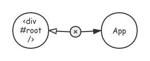
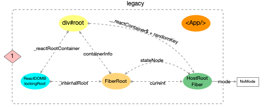

## 0. ReactDOM.render

`react`正式调用 `render`之前, `reactElement(<App/>)`和 DOM 对象`div#root`之间没有关联, 用图片表示如下:



`ReactDOM.render` 是  `react` 里渲染虚拟 `dom` 到真实节点的 `api`，它接受 `element` 、`container` 和 `callback` 三个参数，内部调用了 `legacyRenderSubtreeIntoContainer` (遗留的子树渲染 `api`将来可能会删除) 来渲染子节点：

+ `element`：这个参数 `React$Element<any>` 表示接受多种类型的 `ReactElement`；

[react-dom/ReactDom.js]()

```ts
const ReactDOM: Object = {
	render(
    element: React$Element<any>,
    container: DOMContainer,
    callback: ?Function,
  ) {
    return legacyRenderSubtreeIntoContainer(
      null,
      element,
      container,
      false,
      callback,
    );
  },
}
```

根据`ReactDOM.render`中 `legacyRenderSubtreeIntoContainer` 的调用情况也可以发现`parentComponent`是写死的`null`。

注意这里的第四个参数 `forceHydrate` 是 `false` 是指服务端渲染的注水选项，在 `render` 中是关闭的，后面我们呢也会忽略源码中服务端渲染的相关内容。

## 1. legacyRenderSubtreeIntoContainer

[react-dom/ReactDom.js]()

```ts
function legacyRenderSubtreeIntoContainer(
  parentComponent: ?React$Component<any, any>,
  children: ReactNodeList,
  container: DOMContainer,
  forceHydrate: boolean,
  callback: ?Function,
) {
  let root: Root = (container._reactRootContainer: any);
  if (!root) {
    // Initial mount
    root = container._reactRootContainer = legacyCreateRootFromDOMContainer(
      container,
      forceHydrate,
    );
    if (typeof callback === 'function') {
      const originalCallback = callback;
      callback = function() {
        const instance = DOMRenderer.getPublicRootInstance(root._internalRoot);
        originalCallback.call(instance);
      };
    }
    // Initial mount should not be batched.
    DOMRenderer.unbatchedUpdates(() => {
      if (parentComponent != null) {
        root.legacy_renderSubtreeIntoContainer(
          parentComponent,
          children,
          callback,
        );
      } else {
        root.render(children, callback);
      }
    });
  } else {
    if (typeof callback === 'function') {
      const originalCallback = callback;
      callback = function() {
        const instance = DOMRenderer.getPublicRootInstance(root._internalRoot);
        originalCallback.call(instance);
      };
    }
    // Update
    if (parentComponent != null) {
      root.legacy_renderSubtreeIntoContainer(
        parentComponent,
        children,
        callback,
      );
    } else {
      root.render(children, callback);
    }
  }
  return DOMRenderer.getPublicRootInstance(root._internalRoot);
}
```

这个函数大概分为三个执行步骤，下面进行详细讲解：

### 1.1 节点初始化

渲染子树的代码中分为两种情况，如果说是首次渲染 `root = container._reactRootContainer: any`为 `null` 那么就调用 `legacyCreateRootFromDOMContainer` 初始化根节点。

[react-dom/ReactDom.js]()

```ts
function legacyRenderSubtreeIntoContainer(
  parentComponent: ?React$Component<any, any>,
  children: ReactNodeList,
  container: DOMContainer,
  forceHydrate: boolean,
  callback: ?Function,
) {
  let root: Root = (container._reactRootContainer: any)
  if (!root) {
    // Initial mount
    root = container._reactRootContainer = legacyCreateRootFromDOMContainer(
      container,
      forceHydrate,
    )
	// ...
}
```

#### 1.1.1 创建 `ReactRoot`

下面我们来看一下其中初始化根节点的代码，因为我们使用的是 `render` 所以不会开启注水，所以 `container` 中所有的子节点都会被传入的组件替换掉。

然后主要看的最后一行，`legacyCreateRootFromDOMContainer` 对传入的 `container` 包装并且返回了一个 `ReactRoot`，其中之一的属性就是上面的 `container._reactRootContainer`。

[react-dom/ReactDom.js]()

```js
function legacyCreateRootFromDOMContainer(
  container: DOMContainer,
  forceHydrate: boolean,
): Root {
  const shouldHydrate =
    forceHydrate || shouldHydrateDueToLegacyHeuristic(container)
  // First clear any existing content.
  if (!shouldHydrate) {
    let warned = false
    let rootSibling
    while ((rootSibling = container.lastChild)) {
      container.removeChild(rootSibling)
    }
  }
  // Legacy roots are not async by default.
  const isConcurrent = false
  return new ReactRoot(container, isConcurrent, shouldHydrate)
}
```

`ReactRoot`可以看成是一个顶级树类，其接口类型如下：`_internalRoot` 是它和 `FiberRoot` 链接的桥梁，同时它还有一个 `render` 方法后文会用到：

```ts
type Root = {
  render(children: ReactNodeList, callback: ?() => mixed): Work,
  unmount(callback: ?() => mixed): Work,
  legacy_renderSubtreeIntoContainer(
    parentComponent: ?React$Component<any, any>,
    children: ReactNodeList,
    callback: ?() => mixed,
  ): Work,
  createBatch(): Batch,

  _internalRoot: FiberRoot,
};
```

#### 1.1.2 创建 `FiberRoot`

创建`ReactRoot`的时候会调用`DOMRenderer.createContainer`创建`FiberRoot`，在后期调度更新的过程中这个节点非常重要，在这里不多做介绍：

[react-dom/ReactDom.js]()

```ts
function ReactRoot(
  container: Container,
  isConcurrent: boolean,
  hydrate: boolean,
) {

  const root = DOMRenderer.createContainer(container, isConcurrent, hydrate)
  this._internalRoot = root
}
```

[react-reconciler/ReactFiberReconciler.js]()

```js
export function createContainer(
  containerInfo: Container,
  isConcurrent: boolean,
  hydrate: boolean,
): OpaqueRoot {
  return createFiberRoot(containerInfo, isConcurrent, hydrate);
}
```

接下来就进入了创建 `FiberRoot` 的流程，`react-reconciler` 负责包与包之间的调和，这里它就负责构造一个`FIberRoot`：

[react-reconciler/ReactFiber.js]()

```ts
export type FiberRoot = {
  ...BaseFiberRootProperties,
  ...ProfilingOnlyFiberRootProperties,
};

export function createFiberRoot(
  containerInfo: any,
  isConcurrent: boolean,
  hydrate: boolean,
): FiberRoot {
  const uninitializedFiber = createHostRootFiber(isConcurrent);

  let root;
  if (enableSchedulerTracing) {
    root = ({
      current: uninitializedFiber,
    }: FiberRoot);
  } else {
    root = ({
      current: uninitializedFiber,
    }: BaseFiberRootProperties);
  }

  uninitializedFiber.stateNode = root;

  return ((root: any): FiberRoot);
}

```

#### 1.1.3 创建 `HostRootFiber`

同时还要构造 `FiberRoot` 对应的顶级 `Fiber` 节点 `RootFiber`，并且和 `FiberRoot` 进行连接。
[react-reconciler/ReactFiber.js]()

```ts
export function createHostRootFiber(isConcurrent: boolean): Fiber {
  let mode = isConcurrent ? ConcurrentMode | StrictMode : NoContext;

  if (enableProfilerTimer && isDevToolsPresent) {
    // Always collect profile timings when DevTools are present.
    // This enables DevTools to start capturing timing at any point–
    // Without some nodes in the tree having empty base times.
    mode |= ProfileMode;
  }

  return createFiber(HostRoot, null, null, mode);
}
```

[react-reconciler/ReactFiber.js]()

```ts
const createFiber = function(
  tag: WorkTag,
  pendingProps: mixed,
  key: null | string,
  mode: TypeOfMode,
): Fiber {
  // $FlowFixMe: the shapes are exact here but Flow doesn't like constructors
  return new FiberNode(tag, pendingProps, key, mode);
};
```

> [注意:]()`fiber`树中所节点的`mode`都会和`HostRootFiber.mode`一致(新建的 fiber 节点, 其 mode 来源于父节点),所以**HostRootFiber.mode**非常重要, 它决定了以后整个 fiber 树构建过程.

将此刻内存中对象的引用情况表示出来:



### 1.2 渲染子树

回到刚刚 `legacyRenderSubtreeIntoContainer` 这个函数上面已经完成了根节点(容器)的创建下面就该开始渲染内容了，在 `render` 流程里 `parentComponent` 是 `null` 所以我们忽略其中的代码，直接走 `root.render`

> `DOMRenderer.unbatchedUpdates`制定不使用`batchedUpdates`，因为这是初次渲染，需要尽快完成。这里涉及到批量更新的过程我们暂时不考虑。

```js
function legacyRenderSubtreeIntoContainer(
  parentComponent: ?React$Component<any, any>,
  children: ReactNodeList,
  container: DOMContainer,
  forceHydrate: boolean,
  callback: ?Function,
) {
    // ...
		if (typeof callback === 'function') {
      const originalCallback = callback
      callback = function() {
        const instance = DOMRenderer.getPublicRootInstance(root._internalRoot)
        originalCallback.call(instance)
      }
    }
    // Initial mount should not be batched.
    DOMRenderer.unbatchedUpdates(() => {
      if (parentComponent != null) {
        // 一般不会出现，暂时不考虑
      } else {
        root.render(children, callback)
      }
    })
  } else {
    // 有root的情况，暂时不考虑
  }
  return DOMRenderer.getPublicRootInstance(root._internalRoot)
}
```

#### 1.2.1 ReactRoot.prototype.render

上面的流程已经创建了 `ReactRoot` ，接下来就可以进入组件渲染流程 `ReactRoot.prototype.render`：

[react-dom/ReactDom.js]()

```ts
ReactRoot.prototype.render = function(
  children: ReactNodeList,
  callback: ?() => mixed,
): Work {
  const root = this._internalRoot
  const work = new ReactWork()
  callback = callback === undefined ? null : callback
  if (callback !== null) {
    work.then(callback)
  }

  DOMRenderer.updateContainer(children, root, null, work._onCommit)
  return work
}
```

其中`DOMRenderer`是`react-reconciler/src/ReactFiberReconciler`，他的`updateContainer`如下在这里计算了一个时间，这个时间叫做`expirationTime`，顾名思义就是这次更新的 **超时时间**。

[react-reconciler/ReactFiberReconciler.js]()

```ts
export function updateContainer(
  element: ReactNodeList,
  container: OpaqueRoot,
  parentComponent: ?React$Component<any, any>,
  callback: ?Function,
): ExpirationTime {
  const current = container.current
  const currentTime = requestCurrentTime()
  const expirationTime = computeExpirationForFiber(currentTime, current)
  return updateContainerAtExpirationTime(
    element,
    container,
    parentComponent,
    expirationTime,
    callback,
  )
}
```

然后调用了`updateContainerAtExpirationTime`，我们可以抛开 `context` 的部分，但是在这个方法里调用了`scheduleRootUpdate`就非常重要了，注意这时候的 `container` 是一个 `FiberRoot` 而他的 `current` 就是它的 `Fiber`调度器： 

[react-reconciler/ReactFiberReconciler.js]()

```js
export function updateContainerAtExpirationTime(
  element: ReactNodeList,
  container: OpaqueRoot,
  parentComponent: ?React$Component<any, any>,
  expirationTime: ExpirationTime,
  callback: ?Function,
) {
  // TODO: If this is a nested container, this won't be the root.
  const current = container.current
  const context = getContextForSubtree(parentComponent)
  if (container.context === null) {
    container.context = context
  } else {
    container.pendingContext = context
  }

  return scheduleRootUpdate(current, element, expirationTime, callback)
}
```

### 1.3 生成更新队列并进入调度

调度的整体代码：

[react-reconciler/ReactFiberReconciler.js]()

```js
function scheduleRootUpdate(
  current: Fiber,
  element: ReactNodeList,
  expirationTime: ExpirationTime,
  callback: ?Function,
) {
  const update = createUpdate(expirationTime)

  update.payload = { element }

  callback = callback === undefined ? null : callback
  if (callback !== null) {
    update.callback = callback
  }
  enqueueUpdate(current, update) // Fiber Update

  scheduleWork(current, expirationTime)
  return expirationTime
}
```

#### 1.3.1 生成 update

首先要生成一个`update`，不管你是`setState`还是`ReactDOM.render`造成的 React 更新，都会生成一个叫`update`的对象，并且会赋值给`Fiber.updateQueue`

[react-reconciler/ReactFiberReconciler.js]()

```js
function scheduleRootUpdate(
  current: Fiber,
  element: ReactNodeList,
  expirationTime: ExpirationTime,
  callback: ?Function,
) {
  const update = createUpdate(expirationTime)

  update.payload = { element }

  callback = callback === undefined ? null : callback
  if (callback !== null) {
    update.callback = callback
  }
  // ...
}

```

`Update`是 `Update` 链表中的一个节点，这里我们使用 `createUpdate` 创建并且声明优先级为 `UpdateState(1)`， 因为这里我们是第一次更新，所以 `payload` 为 `element`：

[react-reconciler/ReactUpdateQueue.js]()

```js
export function createUpdate(expirationTime: ExpirationTime): Update<*> {
  return {
    expirationTime: expirationTime,

    tag: UpdateState,
    payload: null,
    callback: null,

    next: null,
    nextEffect: null,
  };
}
```

#### 1.3.2 推入 update

[react-reconciler/ReactFiberReconciler.js]()

```js
function scheduleRootUpdate(
  current: Fiber,
  element: ReactNodeList,
  expirationTime: ExpirationTime,
  callback: ?Function,
) {
	enqueueUpdate(current, update) // Fiber Update
}
```

`updateQueue`队列的作用是用来记录该 fiber 对象的更新操作, 在 fiber 节点更新中会用到。


再接下来我们要通过 `enqueueUpdate` 将这次更新推入到根节点 `Fiber` 对应的 `updateQueue` 里，本来直接入队列即可，但是由于 `Fiber` 使用了 `alternate` 进行 `double buffer` 性能优化，所以这里要处理 `current` 和 `workInProgress` 两个 `Fiber` 状态中的 `queue`:

[react-reconciler/ReactUpdateQueue.js]()

```js
export function enqueueUpdate<State>(fiber: Fiber, update: Update<State>) {
  // Update queues are created lazily.
  const alternate = fiber.alternate;
  let queue1;	// current
  let queue2;	// workInProgress
  if (alternate === null) {
    // There's only one fiber.
    queue1 = fiber.updateQueue;
    queue2 = null;
    if (queue1 === null) {
      queue1 = fiber.updateQueue = createUpdateQueue(fiber.memoizedState);
    }
```

第一种情况只有 `current` 状态，那`q1`会被赋值，如果此时 `Fiber` 上还没有队列就用下面的函数做初始化：

[react-reconciler/ReactUpdateQueue.js]()

```js
export function createUpdateQueue<State>(baseState: State): UpdateQueue<State> {
  const queue: UpdateQueue<State> = {
    baseState,
    firstUpdate: null,
    lastUpdate: null,
    firstCapturedUpdate: null,
    lastCapturedUpdate: null,
    firstEffect: null,
    lastEffect: null,
    firstCapturedEffect: null,
    lastCapturedEffect: null,
  };
  return queue;
}
```

后面的逻辑也很简单，就是对 `queue1`、`queue2` 的内容进行填充以及克隆，总之就是要保证两个 `Fiber` 都有更新队列，并且两个队列要保持一致：

[react-reconciler/ReactUpdateQueue.js]()

```js  } else {
export function enqueueUpdate<State>(fiber: Fiber, update: Update<State>) {
  	// ...
	} else {
		// There are two owners.
    queue1 = fiber.updateQueue;
    queue2 = alternate.updateQueue;
    if (queue1 === null) {
      if (queue2 === null) {
        // Neither fiber has an update queue. Create new ones.
        queue1 = fiber.updateQueue = createUpdateQueue(fiber.memoizedState);
        queue2 = alternate.updateQueue = createUpdateQueue(
          alternate.memoizedState,
        );
      } else {
        // Only one fiber has an update queue. Clone to create a new one.
        queue1 = fiber.updateQueue = cloneUpdateQueue(queue2);
      }
    } else {
      if (queue2 === null) {
        // Only one fiber has an update queue. Clone to create a new one.
        queue2 = alternate.updateQueue = cloneUpdateQueue(queue1);
      } else {
        // Both owners have an update queue.
      }
    }
  }
}
```

最后就是向两个队列里推入新的任务的代码了，这里的代码也很有趣，可以看到两个队列都非空的分支中只是将新的 `update` 推入到了 `queue1` 中，这是因为两个队列中的 `update` 其实都是一个指向，所以只需要单独更新 `queue2.lastUpdate` 这是不同的指向：

[react-reconciler/ReactUpdateQueue.js]()

```js
export function enqueueUpdate<State>(fiber: Fiber, update: Update<State>) {
	if (queue2 === null || queue1 === queue2) {
    // There's only a single queue.
    appendUpdateToQueue(queue1, update);
  } else {
    // There are two queues. We need to append the update to both queues,
    // while accounting for the persistent structure of the list — we don't
    // want the same update to be added multiple times.
    if (queue1.lastUpdate === null || queue2.lastUpdate === null) {
      // One of the queues is not empty. We must add the update to both queues.
      appendUpdateToQueue(queue1, update);
      appendUpdateToQueue(queue2, update);
    } else {
      // Both queues are non-empty. The last update is the same in both lists,
      // because of structural sharing. So, only append to one of the lists.
      appendUpdateToQueue(queue1, update);
      // But we still need to update the `lastUpdate` pointer of queue2.
      queue2.lastUpdate = update;
    }
  }
```

这里的 `appendUpdateToQueue` 是一个很基础的链表插入函数，队列为空那么前后指针都指向新节点，队列不为空则向后添加：

[react-reconciler/ReactUpdateQueue.js]()

```tsx
function appendUpdateToQueue<State>(
  queue: UpdateQueue<State>,
  update: Update<State>,
) {
  // Append the update to the end of the list.
  if (queue.lastUpdate === null) {
    // Queue is empty
    queue.firstUpdate = queue.lastUpdate = update;
  } else {
    queue.lastUpdate.next = update;
    queue.lastUpdate = update;
  }
}
```

在 `update` 节点添加完毕之后整体的数据结构就变成了这个样子：


#### 1.3.3 开始调度

[react-reconciler/ReactFiberReconciler.js]()

```js
function scheduleRootUpdate(
  current: Fiber,
  element: ReactNodeList,
  expirationTime: ExpirationTime,
  callback: ?Function,
) {
	// ...
  scheduleWork(current, expirationTime)
  return expirationTime
}
```

然后就是调用`scheduleWork`。注意到这里之前`setState`和`ReactDOM.render`是不一样，但进入`schedulerWork`之后，就是任务调度的事情了，跟之前你是怎么调用的没有任何关系

