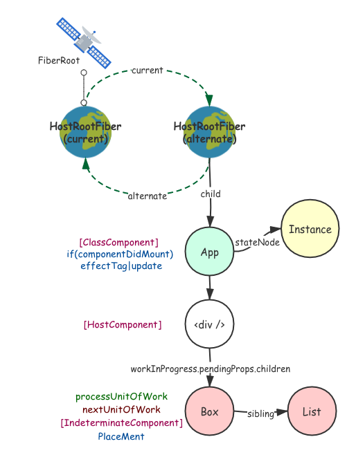
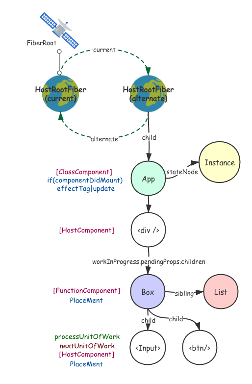
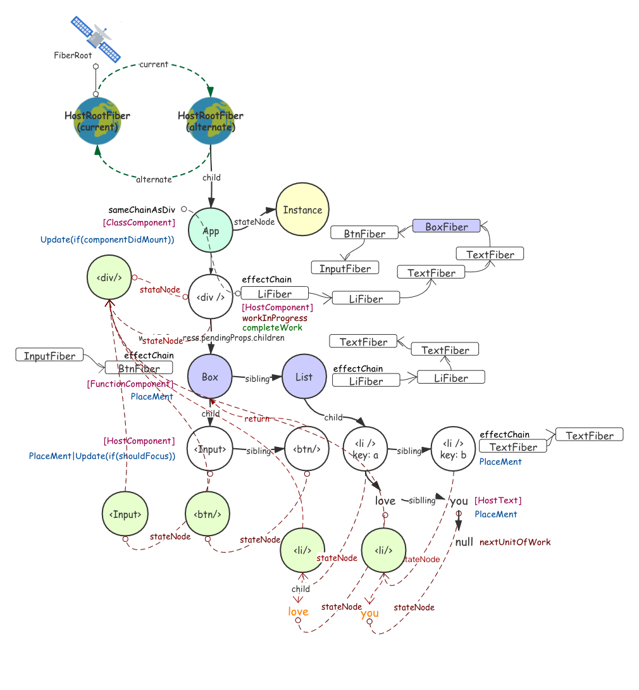
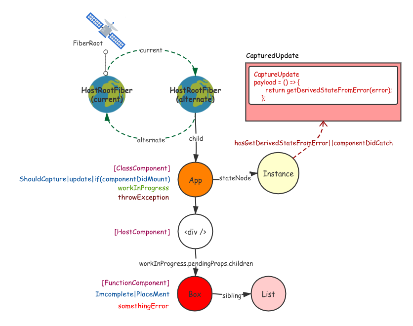
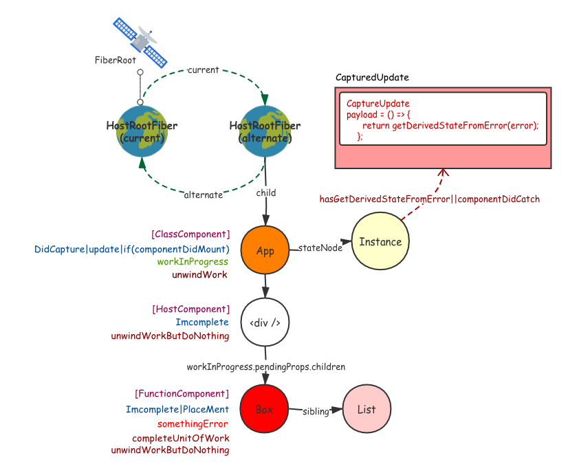
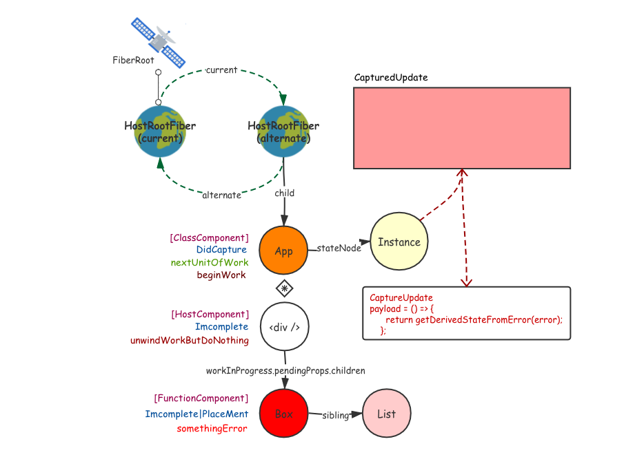

## 0. constants

==expirationContext==

保存创建`expirationTime`的上下文，在`syncUpdates`和`deferredUpdates`中分别被设置为`Sync`和`AsyncExpirationTime`，在有这个上下文的时候任何更新计算出来的过期时间都等于`expirationContext`。

比如调用`ReactDOM.flushSync`的时候，他接受的回调中的`setState`

```ts
// Represents the expiration time that incoming updates should use. (If this
// is NoWork, use the default strategy: async updates in async mode, sync
// updates in sync mode.)
let expirationContext: ExpirationTime = NoWork;
```

==isWorking==

`commitRoot`和`renderRoot`开始都会设置为`true`，然后在他们各自阶段结束的时候都重置为`false`。

```ts
let isWorking: boolean = false;
```

==isCommitting==

`commitRoot`开头设置为`true`，结束之后设置为`false`

```ts
let isCommitting: boolean = false;
```

**用来标志是否处于`commit`阶段**

==nextUnitOfWork==

用于记录`render`阶段`Fiber`树遍历过程中下一个需要执行的节点。

```ts
let nextUnitOfWork: Fiber | null = null;
```

在`resetStack`中分别被重置，他只会指向`workInProgress`(`alternate`)，

==nextRoot & nextRenderExpirationTime==

用于记录**下一个将要渲染的`root`节点**和**下一个要渲染的任务的`ExpirationTime`** 

```ts
let nextRoot: FiberRoot | null = null;
// The time at which we're currently rendering work.
let nextRenderExpirationTime: ExpirationTime = NoWork;
```

在`renderRoot`开始的时候赋值，需要符合如下条件才会重新赋值

```js
if (
  expirationTime !== nextRenderExpirationTime ||
  root !== nextRoot ||
  nextUnitOfWork === null
) {
  resetStack()
  nextRoot = root
  nextRenderExpirationTime = expirationTime
  nextUnitOfWork = createWorkInProgress(
    nextRoot.current,
    null,
    nextRenderExpirationTime,
  )
}
```

解释一下就是说，只有这一次调用`renderRoot`的时候，有

- 新的`root`要渲染
- 相同的`root`但是任务有不同优先级的任务要渲染
- 或者在老的任务上没有下一个节点需要渲染了

==nextEffect==

用于`commit`阶段记录`firstEffect -> lastEffect`链遍历过程中的每一个`Fiber`

```ts
// The next fiber with an effect that we're currently committing.
let nextEffect: Fiber | null = null;
```

==interruptedBy==

给开发工具用的，用来展示被哪个节点打断了异步任务：

```ts
// Used for performance tracking.
let interruptedBy: Fiber | null = null;
```

## 1. renderRoot

[react-reconciler/src/ReactFiberScheduler.js]()

```tsx
function renderRoot(
  root: FiberRoot,
  isYieldy: boolean,
  isExpired: boolean,
): void {
  isWorking = true;
  const expirationTime = root.nextExpirationTimeToWorkOn;

  // Check if we're starting from a fresh stack, or if we're resuming from
  // previously yielded work.
  if (
    expirationTime !== nextRenderExpirationTime ||
    root !== nextRoot ||
    nextUnitOfWork === null
  ) {
    // Reset the stack and start working from the root.
    resetStack();
    nextRoot = root;
    nextRenderExpirationTime = expirationTime;	// 虽然这里都是 nextxxxx 但是其实就是指本轮
    nextUnitOfWork = createWorkInProgress(	// nextUnitOfWork = workInProgress
      nextRoot.current,
      null,
      nextRenderExpirationTime,
    );
    root.pendingCommitExpirationTime = NoWork;
  }

  let didFatal = false;
  do {
    try {
      workLoop(isYieldy); // isYieldy 是否可打断
    } catch (thrownValue) {
      if (nextUnitOfWork === null) {
        // This is a fatal error.
        didFatal = true;
        onUncaughtError(thrownValue);
      } else {
        const failedUnitOfWork: Fiber = nextUnitOfWork;
        const sourceFiber: Fiber = nextUnitOfWork;
        let returnFiber = sourceFiber.return;
        if (returnFiber === null) {
          // This is the root. The root could capture its own errors. However,
          // we don't know if it errors before or after we pushed the host
          // context. This information is needed to avoid a stack mismatch.
          // Because we're not sure, treat this as a fatal error. We could track
          // which phase it fails in, but doesn't seem worth it. At least
          // for now.
          didFatal = true;
          onUncaughtError(thrownValue);
        } else {
          throwException(
            root,
            returnFiber,
            sourceFiber,
            thrownValue,
            nextRenderExpirationTime,
          );
          nextUnitOfWork = completeUnitOfWork(sourceFiber);
          continue;
        }
      }
    }
    break;
  } while (true);

  // We're done performing work. Time to clean up.
  isWorking = false;

  // Yield back to main thread.
  if (didFatal) {
    const didCompleteRoot = false;
    stopWorkLoopTimer(interruptedBy, didCompleteRoot);
    interruptedBy = null;
    // `nextRoot` points to the in-progress root. A non-null value indicates
    // that we're in the middle of an async render. Set it to null to indicate
    // there's no more work to be done in the current batch.
    nextRoot = null;
    onFatal(root);
    return;
  }

  if (nextUnitOfWork !== null) {
    // There's still remaining async work in this tree, but we ran out of time
    // in the current frame. Yield back to the renderer. Unless we're
    // interrupted by a higher priority update, we'll continue later from where
    // we left off.
    const didCompleteRoot = false;
    stopWorkLoopTimer(interruptedBy, didCompleteRoot);
    interruptedBy = null;
    onYield(root);
    return;
  }

  // We completed the whole tree.
  const didCompleteRoot = true;
  stopWorkLoopTimer(interruptedBy, didCompleteRoot);
  const rootWorkInProgress = root.current.alternate;
  invariant(
    rootWorkInProgress !== null,
    'Finished root should have a work-in-progress. This error is likely ' +
      'caused by a bug in React. Please file an issue.',
  );

  // `nextRoot` points to the in-progress root. A non-null value indicates
  // that we're in the middle of an async render. Set it to null to indicate
  // there's no more work to be done in the current batch.
  nextRoot = null;
  interruptedBy = null;

  if (nextRenderDidError) {
    // There was an error
    if (hasLowerPriorityWork(root, expirationTime)) {
      // There's lower priority work. If so, it may have the effect of fixing
      // the exception that was just thrown. Exit without committing. This is
      // similar to a suspend, but without a timeout because we're not waiting
      // for a promise to resolve. React will restart at the lower
      // priority level.
      markSuspendedPriorityLevel(root, expirationTime);
      const suspendedExpirationTime = expirationTime;
      const rootExpirationTime = root.expirationTime;
      onSuspend(
        root,
        rootWorkInProgress,
        suspendedExpirationTime,
        rootExpirationTime,
        -1, // Indicates no timeout
      );
      return;
    } else if (
      // There's no lower priority work, but we're rendering asynchronously.
      // Synchronsouly attempt to render the same level one more time. This is
      // similar to a suspend, but without a timeout because we're not waiting
      // for a promise to resolve.
      !root.didError &&
      !isExpired
    ) {
      root.didError = true;
      const suspendedExpirationTime = (root.nextExpirationTimeToWorkOn = expirationTime);
      const rootExpirationTime = (root.expirationTime = Sync);
      onSuspend(
        root,
        rootWorkInProgress,
        suspendedExpirationTime,
        rootExpirationTime,
        -1, // Indicates no timeout
      );
      return;
    }
  }

  if (!isExpired && nextLatestAbsoluteTimeoutMs !== -1) {
    // The tree was suspended.
    const suspendedExpirationTime = expirationTime;
    markSuspendedPriorityLevel(root, suspendedExpirationTime);

    // Find the earliest uncommitted expiration time in the tree, including
    // work that is suspended. The timeout threshold cannot be longer than
    // the overall expiration.
    const earliestExpirationTime = findEarliestOutstandingPriorityLevel(
      root,
      expirationTime,
    );
    const earliestExpirationTimeMs = expirationTimeToMs(earliestExpirationTime);
    if (earliestExpirationTimeMs < nextLatestAbsoluteTimeoutMs) {
      nextLatestAbsoluteTimeoutMs = earliestExpirationTimeMs;
    }

    // Subtract the current time from the absolute timeout to get the number
    // of milliseconds until the timeout. In other words, convert an absolute
    // timestamp to a relative time. This is the value that is passed
    // to `setTimeout`.
    const currentTimeMs = expirationTimeToMs(requestCurrentTime());
    let msUntilTimeout = nextLatestAbsoluteTimeoutMs - currentTimeMs;
    msUntilTimeout = msUntilTimeout < 0 ? 0 : msUntilTimeout;

    // TODO: Account for the Just Noticeable Difference

    const rootExpirationTime = root.expirationTime;
    onSuspend(
      root,
      rootWorkInProgress,
      suspendedExpirationTime,
      rootExpirationTime,
      msUntilTimeout,
    );
    return;
  }

  // Ready to commit.
  onComplete(root, rootWorkInProgress, expirationTime);
}
```

这个函数有点长，我画一张图解释它的大概流程：

.png)

进入 `renderRoot`之后判断当前任务是不是一个打断的任务，需要进行一些全局变量初始化，之后进入 `workLoop` 一旦在 `workLoop` 中抛出错误就由 `throwExpection` 和 `completeUnitOfWork` 处理然后回到 `workLoop`。

## 2. workLoop

[react-reconciler/src/ReactFiberScheduler.js]()

```ts
function workLoop(isYieldy) {
  if (!isYieldy) {
    // Flush work without yielding
    while (nextUnitOfWork !== null) {
      nextUnitOfWork = performUnitOfWork(nextUnitOfWork);
    }
  } else {
    // Flush asynchronous work until the deadline runs out of time.
    while (nextUnitOfWork !== null && !shouldYield()) {
      nextUnitOfWork = performUnitOfWork(nextUnitOfWork);
    }
  }
}
```

`workLoop` 就是不断的通过调用 `performUnitOfWork`：

### 2.1 performUnitOfWork

[react-reconciler/src/ReactFiberScheduler.js]()

```ts
function performUnitOfWork(workInProgress: Fiber): Fiber | null {
  const current = workInProgress.alternate;

  // See if beginning this work spawns more work.
  startWorkTimer(workInProgress);

  let next;
  if (enableProfilerTimer) {
    if (workInProgress.mode & ProfileMode) {
      startProfilerTimer(workInProgress);
    }

    next = beginWork(current, workInProgress, nextRenderExpirationTime);
    workInProgress.memoizedProps = workInProgress.pendingProps;

    if (workInProgress.mode & ProfileMode) {
      // Record the render duration assuming we didn't bailout (or error).
      stopProfilerTimerIfRunningAndRecordDelta(workInProgress, true);
    }
  } else {
    next = beginWork(current, workInProgress, nextRenderExpirationTime);
    workInProgress.memoizedProps = workInProgress.pendingProps;
  }

  if (next === null) {
    // If this doesn't spawn new work, complete the current work.
    next = completeUnitOfWork(workInProgress);
  }

  ReactCurrentOwner.current = null;
  return next;
}
```

这个函数按照一个深度优先遍历的顺序构建 `fiber` 树。

## 3. work flow

相信说到这里大家都懵了，所以这里我拿一个实际的 `ElementTree` 构建 `fiberTree` 的过程来演示一下，这部分推荐大家在读完 `3.8` 之后回过来看，这样理解的比较清楚。

### 3.1 beginWork

在栗子🌰里我们使用下面这个简单的 `domTree` 作为第一次构建的对象：

.png)

跳过前面构建 `fiberRoot` 和 `HostRootFIber`的过程，现在执行 `renderRoot`，由于 `nextUnitOfWork === null` 所以执行 `resetStack` 等一系列初始化，并且给 `HostRootFiber` 设置 `WIP`作为 `nextUnitOfWork`：

.png)

之后会对 `HostRootFiber` 的 `alternate` 执行 `beginWork`，命中 `HostRoot` 的分支走`updateHostRoot`，由于是第一次更新并且只有一个子节点所以直接 `reconcileSingleElement`，子节点 `App` 是一个 `ClassComponent`所以构建 `createFiberFromElemnent` 之后会设置 `fiberTag`：

.png)

之后对 `App`的 `fiber`执行`beginWork`，命中 `ClassComponent`(刚设置的)，调用 `createInstance` 和  `mountClassInstance` 构建类组件实例并连接，执行`processState` 计算 `ctor` 过程产生的 `state`，之后执行两个生命周期函数并重新计算，如果这个 `ClassComponent` 有 `ComponentDidMount` 则设置 `update` 标记位。

最后调用 `render` 方法创建子节点传入 `reconcileChildren` 创建 `fiber`子树：

.png)

走到 `div` 这个 `HostComponent`，根据他的 `pendingProps.children` 传入`reconcileChildren`构建子树，由于 `Box`和 `List`都是函数组件，所以初始类型是 `IndeterminateComponent`：



`beginWork` 再执行到 `Box`的时候他的类型会被敲定 `FunctionComponent`，所以走 `FP`的更新流程，执行函数创建子节点，然后 `reconcileChildrenArray` 得到两个子节点 `HostComponent` 的 `fiber`：



> [注意：]()此时 `List` 还是 `IndeterminateComponent`。

在之后由于 `Input` 没有子节点，`next` 会被标定 `null`，所以再执行 `processUnitOfWork`走的就是 `completeUnitOfWork`:

.png)

### 3.2 completeUintOfWork

对 `Input`执行 `completeUnitOfWork`，进入 `completeWork` 对 `HostComponent` 执行构建 `dom` 和属性初始化通过 `stateNode` 连接，由于 `Input` 没有子节点，所以不需要继承 `effect` 链条。并且会重设 `resetChildExpirationTime`：

.png)

之后由于 `InputFiber` 的 `sibling` 不是 `null`，所以会给 `nextUnitOkWork` 赋值 `btnFiber`，然后和 `inputFiber`一样再走一遍 `beginWork`+ `completeUnitOfUnit`的流程，构建 `btn` 节点。

.png)

构建完 `btn`，发现其没有兄弟 `fiber`，所以 `workProgress` 向上游走去，到了 `BoxFiber` 那里，执行` completeWork`，给 `div` 拼接 `effect` 链条。因为这是一个 `FP` 所以 ` completeWork`不会做任何事：

.png)看到下面这张图你可能感觉这跨度有点大，但是其实都是的操作，所以我跳过了一些部分，`Box` 的 `sibling`是 `list`，先对他执行 `beginWork`构建两个 `HostComponent` ，然后对第一 `li` 的 `fiber` 执行同样的操作，一直到两个 `HostText`。

然后向上返回衔接 `effect`，构筑两个文本节点 `love` 和 `you`，之后同样的向上返回拼接 `effect` 构筑节点 `li` ，不过这里要对子节点做一个插入的操作。总之最后一步一步执行到 `listFiber` 这个 `FP`，同样因为这是一个 `FP` 所以 ` completeWork`不会做任何事：-3827707.png)

> 这里我讲的自己都有点懵，自己模拟一下这个过程吧。

然后到了 `divFiber` 做 `completeWork`构建 `dom` 添加子节点设置初始属性，更新父节点的 `effectChain`(这里父节点的 `chain`)和他自己一样，到这里我们的 `domTree`就构建完成了：



终于到了 `AppFiber`，对一个` ComponentFiber`执行 `completeWork` 什么也不会发生，所以这里只会给父节点设置 `effectChain`：

.png)

最后到了 `HostRootFiber` 他的 `returnFIber`是 `null`，所以 `completeUnitOfWork`返回 `null`，`performUnitOfWork`执行完成，此时 `nextUnitOfWork===null`(右下角)，所以 `workLoop` 会退出 ，`renderRoot`里 `workLoop`这部分就结束了！！！！

```ts
function workLoop(isYieldy) {
  if (!isYieldy) {
    // Flush work without yielding
    while (nextUnitOfWork !== null) {
      nextUnitOfWork = performUnitOfWork(nextUnitOfWork);
    }
  } else {
    // Flush asynchronous work until the deadline runs out of time.
    while (nextUnitOfWork !== null && !shouldYield()) {
      nextUnitOfWork = performUnitOfWork(nextUnitOfWork);
    }
  }
}
```

### 3.3 unwindWork

回到`beginWork`执行到 `Box`的时候，如果发生了错误，这个时候错误抛出就走到 `throwExpection`的部分：

.png)

这个函数会一直向上找到一个能能处理错误的组件(`ClassComponent`或者`HostRoot`)，比如是一个 `ClassComponent`并且有 `getDervicedStateFromError`或者`componentDidCatch` 这样的生命周期函数。这个时候会给他添加 `ShouldCapture` 标记位然后添加 `CaptureUpdate`：



`throwExpection`执行完成之后，就会在出错误的节点上继续执行 `completeUnitOfWork`，里面循环这回每次都会执行 `unwindWork` ，并且把父级节点标记位 `InComplete`，不过 `unwindWork`没遍历到 `ClassComponent` 或者 `HostRoot`就不会有任何作用，而对` ClassComponent`或者` HostRoot`会标记`DidCapture`然后取消 `shouldCapture`：




这个捕获错误的组件的 `fiber`会执行 `next.effectTag &= HostEffectMask;` 清空除了` DidCapture` 所有标记位，然后 `completeUnitOfWork` 会跳出，`workLoop` 在这个组件 `fiber` 继续执行 `beginWork`.....

这次 `beginWork` 会执行刚才推入的错误处理生命周期回调，然后卸载全部节点：



> [小贴士：]()`unwindWork`的过程中会清空经过节点的所有副作用，上面没有体现，记在心里就好。