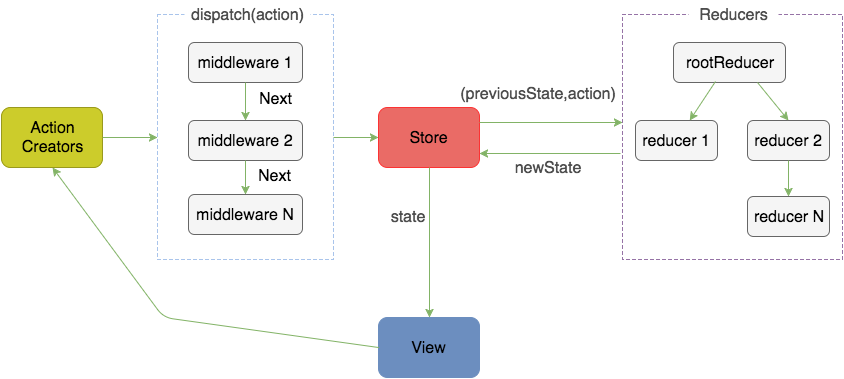
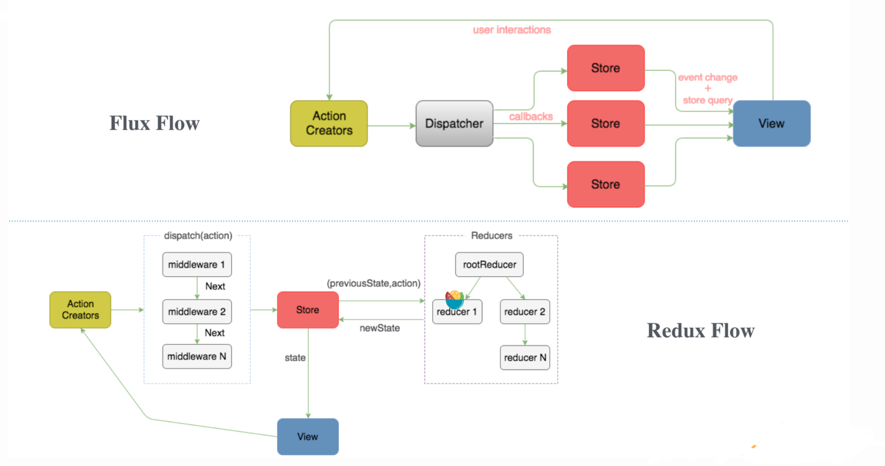

## 设计哲学

阅读源码之前首要的是理解 `redux` 的设计哲理，包括它的基本架构和工作流，`Redux` 是 `JavaScript` 状态容器，能提供可预测化的状态管理。它认为：

- `Web` 应用是一个状态机，视图与状态是一一对应的。
- 所有的状态，保存在一个对象里面。

### 状态容器

我们先来看看“状态容器”、“视图与状态一一对应”以及“一个对象”这三个概念的具体体现。

如上图，Store是Redux中的状态容器，它里面存储着所有的状态数据，每个状态都跟一个视图一一对应。

Redux也规定，一个State对应一个View。只要State相同，View就相同，知道了State，就知道View是什么样，反之亦然。比如，当前页面分三种状态：loading（加载中）、success（加载成功）或者error（加载失败），那么这三个就分别唯一对应着一种视图。

### 工作流

我们对“状态容器”以及“视图与状态一一对应”有所了解了，那么Redux是怎么实现可预测化的呢？我们再来看下Redux的工作流。

首先，我们看下几个核心概念：

- `Store`：保存数据的地方，你可以把它看成一个容器，整个应用只能有一个Store。
- `State`：Store对象包含所有数据，如果想得到某个时点的数据，就要对Store生成快照，这种时点的数据集合，就叫做State。
- `Action`：State的变化，会导致View的变化。但是，用户接触不到State，只能接触到View。所以，State的变化必须是View导致的。Action就是View发出的通知，表示State应该要发生变化了。
- `Action Creator`：View要发送多少种消息，就会有多少种Action。如果都手写，会很麻烦，所以我们定义一个函数来生成Action，这个函数就叫Action Creator。
- `dispatch`：是View发出Action的唯一方法。
- `Reducer`：Store收到Action以后，必须给出一个新的State，这样View才会发生变化。这种State的计算过程就叫做Reducer。Reducer是一个函数，它接受Action和当前State作为参数，返回一个新的State。

然后我们过下整个工作流程：

1. 首先，用户（通过 `View` ）发出 `Action`，发出方式就用到了 `dispatch` 方法。
2. 然后，`Store` 自动调用 `Reducer`，并且传入两个参数：当前 `State` 和收到的 `Action`，`Reducer` 会返回新的 `State`
3. `State` 一旦有变化，`Store` 就会调用监听函数，来更新 `View`。

到这儿为止，一次用户交互流程结束。可以看到，在整个流程中数据都是单向流动的，这种方式保证了流程的清晰。

### 效率提升

前端复杂性的根本原因是大量无规律的交互和异步操作。变化和异步操作的相同作用都是改变了当前View的状态，但是它们的无规律性导致了前端的复杂，而且随着代码量越来越大，我们要维护的状态也越来越多。

我们很容易就对这些状态何时发生、为什么发生以及怎么发生的失去控制。那么怎样才能让这些状态变化能被我们预先掌握，可以复制追踪呢？

这就是Redux设计动机所在。Redux让每个State变化都是可预测的，将应用中所有的动作与状态都统一管理，让一切有据可循。

如上图所示，如果我们的页面比较复杂，又没有用任何数据层框架的话，就是图片上这个样子：交互上存在父子、子父、兄弟组件间通信，数据也存在跨层、反向的数据流。

这样的话，我们维护起来就会特别困难，那么我们理想的应用状态是什么样呢？看下图：

架构层面上讲，我们希望UI跟数据和逻辑分离，UI只负责渲染，业务和逻辑交由其它部分处理，从数据流向方面来说, 单向数据流确保了整个流程清晰。

我们之前的操作可以复制、追踪出来，这也是 `Redux` 的主要设计思想。

综上，`Redux` 可以做到：

- 每个 `State` 变化可预测。
- 动作与状态统一管理。

## 思想追溯

`Redux` 作者在 `Redux.js` 官方文档 `Motivation` 一章的最后一段明确提到：

> Following in the steps of Flux, CQRS, and Event Sourcing , Redux attempts to make state mutations predictable by imposing certain restrictions on how and when updates can happen.

大体的意思就是 `Redux` 通过对更新发生的方式和时间施加某些限制，使 `state mutation` 成为可预测的。 我们就先了解下`Flux`、`CQRS`、`ES`（`Event Sourcing` 事件溯源）这几个概念。

### ES (`Event Sourcing`)

- 不是保存对象的最新状态，而是保存对象产生的事件。
- 通过事件追溯得到对象最新状态。

举个例子：我们平常记账有两种方式，直接记录每次账单的结果或者记录每次的收入/支出，那么我们自己计算的话也可以得到结果，ES就是后者。

与传统增删改查关系式存储的区别：

- 传统的增删是以结果为导向的数据存储，ES是以过程为导向存储。
- CRUD是直接对库进行操作。
- ES是在库里存了一系列事件的集合，不直接对库里记录进行更改。

优点：

- 高性能：事件是不可更改的，存储的时候并且只做插入操作，也可以设计成独立、简单的对象。所以存储事件的成本较低且效率较高，扩展起来也非常方便。
- 简化存储：事件用于描述系统内发生的事情，我们可以考虑用事件存储代替复杂的关系存储。
- 溯源：正因为事件是不可更改的，并且记录了所有系统内发生的事情，我们能用它来跟踪问题、重现错误，甚至做备份和还原。

缺点：

- 事件丢失：因为ES存储都是基于事件的，所以一旦事件丢失就很难保证数据的完整性。
- 修改时必须兼容老结构：指的是因为老的事件不可变，所以当业务变动的时候新的事件必须兼容老结构。

### CQRS (`Command Query Responsibility Segregation`)

顾名思义，“命令与查询职责分离”–>”读写分离”。

整体的思想是把 `Query` 操作和 `Command` 操作分成两块独立的库来维护，当事件库有更新时，再来同步读取数据库。

看下 `Query` 端，只是对数据库的简单读操作。然后 `Command` 端，是对事件进行简单的存储，同时通知 `Query` 端进行数据更新，这个地方就用到了 `ES`。

优点：

- `CQ` 两端分离，各自独立。
- 技术代码和业务代码完全分离。

缺点：

- 强依赖高性能可靠的分布式消息队列。

### Flux

Flux 是一种架构思想，下面过程中，数据总是“单向流动”，任何相邻的部分都不会发生数据的“双向流动”，这保证了流程的清晰。Flux 的最大特点，就是数据的“单向流动”。

1. 用户访问 `View` 。
2. `View` 发出用户的 `Action` 。
3. `Dispatcher` 收到 `Action`，要求 `Store` 进行相应的更新。
4. `Store` 更新后，发出一个 `change` 事件。

介绍完以上之后，我们来整体做一下对比。

### CQRS `->` Flux

相同：当数据在write side发生更改时，一个更新事件会被推送到read side，通过绑定事件的回调，read side得知数据已更新，可以选择是否重新读取数据。

差异：在CQRS中，write side和read side分属于两个不同的领域模式，各自的逻辑封装和隔离在各自的Model中，而在Flux里，业务逻辑都统一封装在Store中。

### Flux `->` Redux

Redux是Flux思想的一种实现，同时又在其基础上做了改进。Redux还是秉承了Flux单向数据流、Store是唯一的数据源的思想。

**最大的区别：**

1. Redux只有一个Store。

Flux中允许有多个Store，但是Redux中只允许有一个，相较于Flux，一个Store更加清晰，容易管理。Flux里面会有多个Store存储应用数据，并在Store里面执行更新逻辑，当Store变化的时候再通知controller-view更新自己的数据；Redux将各个Store整合成一个完整的Store，并且可以根据这个Store推导出应用完整的State。

同时Redux中更新的逻辑也不在Store中执行而是放在Reducer中。单一Store带来的好处是，所有数据结果集中化，操作时的便利，只要把它传给最外层组件，那么内层组件就不需要维持State，全部经父级由props往下传即可。子组件变得异常简单。

1. Redux中没有Dispatcher的概念。

Redux去除了这个Dispatcher，使用Store的Store.dispatch()方法来把action传给Store，由于所有的action处理都会经过这个Store.dispatch()方法，Redux聪明地利用这一点，实现了与Koa、RubyRack类似的Middleware机制。Middleware可以让你在dispatch action后，到达Store前这一段拦截并插入代码，可以任意操作action和Store。很容易实现灵活的日志打印、错误收集、API请求、路由等操作。

除了以上，Redux相对Flux而言还有以下特性和优点：

1. 文档清晰，编码统一。
2. 逆天的DevTools，可以让应用像录像机一样反复录制和重放。

