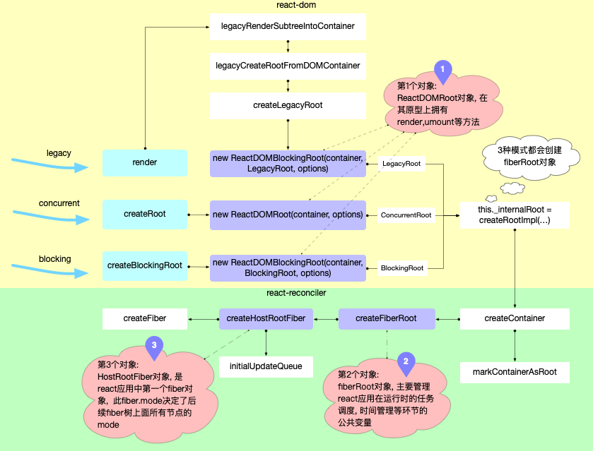

# React 应用初始化

在当前稳定版`react@16.13.1`源码中, 有 3 种启动方式. 先引出官网上对于[这 3 种模式的介绍](https://zh-hans.reactjs.org/docs/concurrent-mode-adoption.html#why-so-many-modes), 其基本说明如下:

[`Legacy`模式](https://zh-hans.reactjs.org/docs/concurrent-mode-adoption.html#migration-step-blocking-mode): 

`ReactDOM.render(<App />, rootNode)`. 这是当前 React app 使用的方式. 这个模式可能不支持这些新功能。

```js
// LegacyRoot
ReactDOM.render(<App />, document.getElementById('root'), dom => {}); 
// 支持callback回调, 参数是一个dom对象
```

[`Blocking`模式](https://zh-hans.reactjs.org/docs/concurrent-mode-adoption.html#migration-step-blocking-mode): 

做为`Legacy`和`Concurrent`之间的过度， `ReactDOM.createBlockingRoot(rootNode).render(<App />)`. 目前正在实验中, 它仅提供了 `concurrent` 模式的小部分功能, 作为迁移到 `concurrent` 模式的第一个步骤.

```ts
// ConcurrentRoot
// 1. 创建ReactDOMRoot对象
const reactDOMRoot = ReactDOM.createRoot(document.getElementById('root'));
// 2. 调用render
reactDOMRoot.render(<App />); // 不支持回调
```

[`Concurrent`模式](https://zh-hans.reactjs.org/docs/concurrent-mode-adoption.html#enabling-concurrent-mode)

 `ReactDOM.createRoot(rootNode).render(<App />)`. 目前在实验中, 未来稳定之后，打算作为 React 的默认开发模式. 这个模式开启了所有的新功能.

```ts
// BolckingRoot
// 1. 创建ReactDOMRoot对象
const reactDOMBolckingRoot = ReactDOM.createBlockingRoot(
  document.getElementById('root'),
);
// 2. 调用render
reactDOMBolckingRoot.render(<App />); // 不支持回调
```

> [注意:]() 虽然`16.13.1`的源码中有[`createRoot`和`createBlockingRoot`方法](https://github.com/facebook/react/blob/v16.13.1/packages/react-dom/src/client/ReactDOM.js#L209), 但是实际在`npm i react-dom`安装`16.13.1`版本后, 却没有这两个方法(可能是构建过程中去掉了).如果要想体验非`legacy`模式, 需要[显示安装实验版本](https://zh-hans.reactjs.org/docs/concurrent-mode-adoption.html#installation).

## 1.初始化流程

在`react`正式调用之前,`reactElement(<App/>)`和 DOM 对象`div#root`之间没有关联, 用图片表示如下:

![img]()

### 1.1 创建全局对象

无论`Legacy, Concurrent或Blocking`模式, react 在初始化时, 都会创建 3 个全局对象

1. `ReactDOM(Blocking)Root`对象
2. `fiberRoot`对象
3. `HostRootFiber` 对象

这 3 个对象是 react 体系得以运行的基本保障, 一经创建大多数场景不会再销毁(除非卸载整个应用`root.unmount()`)

这一步骤涉及到`react-dom`和`react-reconciler`两个包, 核心流程图如下(其中红色标注了 3 个对象的创建时机).



下面逐一解释这 `3` 个对象的创建过程.

#### 1.1.1 创建 `ReactDOM(Blocking)Root` 对象

#####  legacy 模式

`ReactDOM.render` 是  `react` 里渲染虚拟 `dom` 到真实节点的 `api`，它接受 `element` 、`container` 和 `callback` 三个参数，内部调用了 `legacyRenderSubtreeIntoContainer` (遗留的子树渲染 `api`将来可能会删除) 来渲染子节点：

+ `element`：这个参数 `React$Element<any>` 表示接受多种类型的 `ReactElement`；

[react-dom/ReactDomLegacy]()

```ts
export function render(
  element: React$Element<any>,
  container: Container,
  callback: ?Function,
) {
  return legacyRenderSubtreeIntoContainer(
    null,
    element,
    container,
    false,
    callback,
  );
}
```

根据`ReactDOM.render`中 `legacyRenderSubtreeIntoContainer` 的调用情况也可以发现`parentComponent`是写死的`null`。

注意这里的第四个参数 `forceHydrate` 是 `false` 是指服务端渲染的注水选项，在 `render` 中是关闭的，后面我们呢也会忽略源码中服务端渲染的相关内容。

`legacy`模式表面上是直接调用`ReactDOM.render`, 跟踪`ReactDOM.render`实际上调用`legacyRenderSubtreeIntoContainer`：

渲染代码中分为两种情况，如果说是首次渲染 `root = container._reactRootContainer: any`为 `null` 那么就调用 `legacyCreateRootFromDOMContainer` 初始化根节点，这个函数我们先主要看他初始化树结构的部分省略掉后半部分的请求渲染：

[react-dom/ReactDomLegacy]()

```js
function legacyRenderSubtreeIntoContainer(
  parentComponent: ?React$Component<any, any>,
  children: ReactNodeList,
  container: Container,
  forceHydrate: boolean,
  callback: ?Function,
) {
  let root: RootType = (container._reactRootContainer: any);
  let fiberRoot;
  if (!root) {
    // 初次调用, root还未初始化, 会进入此分支
    //1. 创建ReactDOMRoot对象, 初始化react应用环境
    root = container._reactRootContainer = legacyCreateRootFromDOMContainer(
      container,
      forceHydrate,
    );
    fiberRoot = root._internalRoot;

  	// ..
  }
}
```

继续跟踪`legacyCreateRootFromDOMContainer`. 最后调用`new ReactDOMBlockingRoot(container, LegacyRoot, options);`

[react-dom/ReactDomLegacy]()

```ts
function legacyCreateRootFromDOMContainer(
  container: Container,
  forceHydrate: boolean,
): RootType {
  return createLegacyRoot(container);
}
export function createLegacyRoot(
  container: Container,
  options?: RootOptions,
): RootType {
  return new ReactDOMBlockingRoot(container, LegacyRoot, options); // 注意这里的LegacyRoot是固定的, 并不是外界传入的
}

function ReactDOMBlockingRoot(
  container: Container,
  tag: RootTag,
  options: void | RootOptions,
) {
  this._internalRoot = createRootImpl(container, tag, options);
}
```

`ReactDOMBlockingRoot` 可以看成是一个顶级树类，其接口类型如下：`_internalRoot` 是它和 `FiberRoot` 链接的桥梁，同时它还有一个 `render` 方法后文会用到：

```ts
export type RootType = {
  render(children: ReactNodeList): void,
  unmount(): void,
  _internalRoot: FiberRoot,
	...
};
```

#### 1.1.2 创建 HostFiberRoot 对象

`ReactDOM(Blocking)Root`的创建过程中, 通过 `_internalRoot` 链接 `createRootImpl` 创建的 `FiberRoot`：

```ts
// 注意: 3种模式下的tag是各不相同(分别是ConcurrentRoot, BlockingRoot, LegacyRoot).
this._internalRoot = createRootImpl(container, tag, options);
```

接下来我们进入到 `createRootImpl` 中，这个函数创建并且返回了一个 `FiberRoot`：

[react-dom/ReactDomRoot]()

```ts
function createRootImpl(
  container: Container,
  tag: RootTag,
  options: void | RootOptions,
) {
  const root = createContainer(container, tag, hydrate, hydrationCallbacks);
  markContainerAsRoot(root.current, container);
  return root;
}
```

先来看一下 `markContainerAsRoot` 这个函数用于连接 `dom` 节点和 `HostRootFiber`：

[react-dom/ReactDomRoot]()

```ts
const internalContainerInstanceKey = '__reactContainere$' + randomKey;
const randomKey = Math.random()
  .toString(36)
  .slice(2);

export function markContainerAsRoot(hostRoot, node) {
  node[internalContainerInstanceKey] = hostRoot;
}
```

具体的创建 `FiberRoot` 的功能其实属于 [react-reconciler]() 的功能， `createContainer`是一个调和接口所以定义在 [ReactFiberReconciler]() 中作为对外暴露的接口：

[react-reconciler/ReactFiberReconciler.js]()

```ts
export function createContainer(
  containerInfo: Container,
  tag: RootTag,
  hydrate: boolean,
  hydrationCallbacks: null | SuspenseHydrationCallbacks,
): OpaqueRoot {
  return createFiberRoot(containerInfo, tag, hydrate, hydrationCallbacks);
}
```

具体创建 `FiberRoot` 的其实是 `createFiberRoot` 这个函数，在第一章我们还说过 [react-reconciler]() 这个包负责调度调和和 `Fiber` 的管理，这里就体现出来了，[ReactFiberRoot]() 这个包专门负责管理 `FiberRoot`：

[react-reconciler/ReactFiberRoot.js]()

```ts
export function createFiberRoot(
  containerInfo: any,
  tag: RootTag,
  hydrate: boolean,
  hydrationCallbacks: null | SuspenseHydrationCallbacks,
): FiberRoot {
  const root: FiberRoot = (new FiberRootNode(containerInfo, tag, hydrate): any);

  // Cyclic construction. This cheats the type system right now because
  // stateNode is any.
  const uninitializedFiber = createHostRootFiber(tag);
  root.current = uninitializedFiber;
  uninitializedFiber.stateNode = root;

  initializeUpdateQueue(uninitializedFiber);

  return root;
}
```

创建 `FiberRoot` 的代码很简单，就是初始化一个 `FiberRootNode` 结构，包括：

+ 设置 `tag` 为 `LegacyRoot`；
+ 设置 `containerInfo` 为 `dom` 容器节点；

[react-reconciler/ReactFiberRoot.js]()

```ts
function FiberRootNode(containerInfo, tag, hydrate) {
  this.tag = tag;
  this.current = null;
}
```

#### 1.1.3 创建 RootFiber

上面创建 `FiberRoot` 的代码中后，在其 `current` 字段上挂在了实际的 `HostRootFiber` 结构，作为 `Fiber` 树的顶级 `Fiber`：

```ts
const root: FiberRoot = (new FiberRootNode(containerInfo, tag, hydrate): any);

const uninitializedFiber = createHostRootFiber(tag);
root.current = uninitializedFiber;
uninitializedFiber.stateNode = root;

initializeUpdateQueue(uninitializedFiber);
```

`createHostRootFiber` 是创建 `HostRootFibe` 的函数，代码量不多只是给 `RootFiber` 赋予一个 `HostTag` 标记位，因为实际上是没有 `RootFiber` 这个结构的只是 `tag` 位为 `HostTag`：

[react-reconciler/ReactFiber.js]()

```ts
export function createHostRootFiber(tag: RootTag): Fiber {
  let mode;
  if (tag === ConcurrentRoot) {
    mode = ConcurrentMode | BlockingMode | StrictMode;
  } else if (tag === BlockingRoot) {
    mode = BlockingMode | StrictMode;
  } else {
    mode = NoMode;
  }

  if (enableProfilerTimer && isDevToolsPresent) {
    // Always collect profile timings when DevTools are present.
    // This enables DevTools to start capturing timing at any point–
    // Without some nodes in the tree having empty base times.
    mode |= ProfileMode;
  }

  return createFiber(HostRoot, null, null, mode);
}
```

[react-reconciler/ReactFiber.js]()

```ts
const createFiber = function(
  tag: WorkTag,
  pendingProps: mixed,
  key: null | string,
  mode: TypeOfMode,
): Fiber {
  // $FlowFixMe: the shapes are exact here but Flow doesn't like constructors
  return new FiberNode(tag, pendingProps, key, mode);
};
```

> [注意:]()`fiber`树中所节点的`mode`都会和`HostRootFiber.mode`一致(新建的 fiber 节点, 其 mode 来源于父节点),所以**HostRootFiber.mode**非常重要, 它决定了以后整个 fiber 树构建过程.

将此刻内存中对象的引用情况表示出来:


#### 1.1.4 创建更新队列

在上面初始化 `RootFiber` 还有一个至关重要的 `initializeUpdateQueue` 用于初始化 `Fiber` 结构上的更新队列：

```js
initializeUpdateQueue(uninitializedFiber)
```

在 fiber 数据结构中, 有一个`updateQueue`属性. 在创建`HostRootFiber`的同时`HostRootFiber.updateQueue`也已经初始化完成了.

`updateQueue`队列的作用是用来记录该 fiber 对象的更新操作, 在 fiber 节点更新中会用到。


不过 `initializeUpdateQueue` 没向像队列里推入实际的任务结构：

[react-reconciler/ReactUpdateQueue.js]()

```ts
export function initializeUpdateQueue<State>(fiber: Fiber): void {
  const queue: UpdateQueue<State> = {
    baseState: fiber.memoizedState,
    baseQueue: null,
    shared: {
      pending: null,
    },
    effects: null,
  };
  fiber.updateQueue = queue;
}
```

运行到这里, `react`应用的初始化已经完成了.

### 1.2 调用更新入口

回到`legacyRenderSubtreeIntoContainer`函数中有，`updateContainer` 来调用更新入口，这个函数理所当然是 [react-reconciler]() 包中的函数，其中 `unbatchedUpdates` 设计事件循环，可以简单的说第一次渲染走的是 `unbatchedUpdates` 它会设置一个变量 `isBatchedUpdate` 为 `false` 来避免走批量更新而是立刻处理：

```ts
function legacyRenderSubtreeIntoContainer(
	parentComponent: ?React$Component<any, any>,
  children: ReactNodeList,
  container: Container)
{ 
  let fiberRoot    
	if (!root) {
    // 2. 更新容器
    unbatchedUpdates(() => {
      updateContainer(children, fiberRoot, parentComponent, callback);
    });
  } else {
    // root已经初始化, 二次调用render会进入
    // 2. 调用更新
    updateContainer(children, fiberRoot, parentComponent, callback);
  }
  return getPublicRootInstance(fiberRoot);
}
```

对于`updateContainer`的深入分析, 在[fiber 构建(新增节点)](http://www.7km.top/main/render)和[fiber 构建(更新节点)](http://www.7km.top/main/update)中详细讨论. 此处先要明确`react`应用的初始化完成之后便可以通过调用`updateContainer`执行更新.