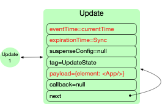
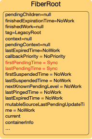
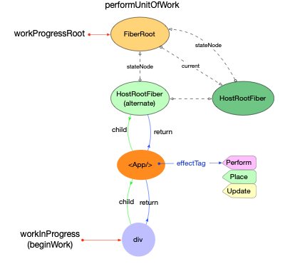
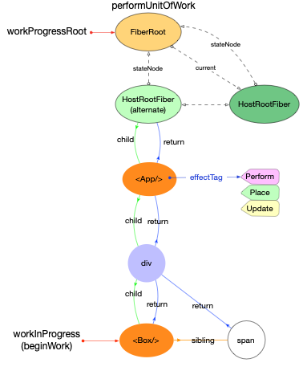
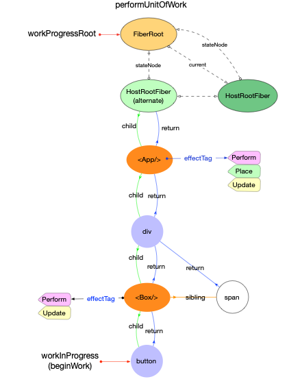
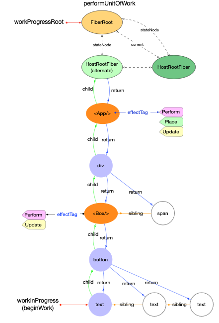

# Init Render

在[React 应用初始化](http://www.7km.top/main/bootstrap)中介绍了`react`应用启动的 3 种模式.为了简便, 本文在`legacy`模式为前提之下进行讨论. 对于`concurrent`和`blocking`的讨论, 会在`任务分片机制`中详细展开.

初始化完成之后, 调用`updateContainer`之前, 先回顾一下此时主要对象的引用关系.


## 1. 调用更新入口

在[React 应用初始化](http://www.7km.top/main/bootstrap#调用更新入口)中通知更新的入口是`updateContainer`函数.

### 1.1 计算 `expirationTime`

`updateContainer` 设计一下四个核心步骤，第一部分`updateContainer`在这里计算了一个时间，这个时间叫做`expirationTime`，顾名思义就是这次更新的 **超时时间**。

[react-reconciler/ReactFiberReconciler]()

```ts
// ... 函数中省略了与legacy无关代码
export function updateContainer(
  element: ReactNodeList,
  container: OpaqueRoot,
  parentComponent: ?React$Component<any, any>,
  callback: ?Function,
): ExpirationTime {
  const current = container.current; // current指向的是RootFiber(Fiber树的根节点)
  //1. 计算本次更新(update)的过期时间(expirationTime)
  //1.1 获取到当前时间
  const currentTime = requestCurrentTimeForUpdate();
  //1.2 当前批量更新的配置, 是一个全局对象, 后面详细展开, 第一次执行这里返回是null
  const suspenseConfig = requestCurrentSuspenseConfig();
  //1.3. 计算本次update的expirationTime, 这个expirationTime会作用于本次更新范围内所有的Fiber对象. 是实现任务stack的核心
  const expirationTime = computeExpirationForFiber(
    currentTime,
    current,
    suspenseConfig,
  ); 
  // ...
}
```

之后它设置了 `FiberRoot.context` 

```ts
export function updateContainer(...args): ExpirationTime {
  // ...
	// legacy下, expirationTime=Sync
  // 2. 设置FiberRoot.context
  // 拿到当前的context, 首次执行返回一个emptyContext, 是一个{}
  const context = getContextForSubtree(parentComponent);
  if (container.context === null) {
    container.context = context;
  }
  // ...
}
```

### 1.2 构造updateQueue

```ts
export function updateContainer(...args): ExpirationTime {
  //3. 初始化current(HostRootFiber)对象的updateQueue队列
  //3.1 创建一个更新(update)对象
  const update = createUpdate(currentTime, expirationTime, suspenseConfig);
  //3.2 设置update对象的payload, 这里element需要注意(是tag=HostRoot特有的设置, 指向<App/>)
  update.payload = { element };
  //3.3 将update对象加入到当前Fiber(这里是RootFiber)的更新对列当中
  enqueueUpdate(current, update);
  //4. 调度和更新current(HostRootFiber)对象
  scheduleUpdateOnFiber(current, expirationTime);
  return expirationTime;
}
```

最后一步，它构造了一个 `update` 任务结构体，并且设置 `payload` 为当前渲染的 `element`  ，并且执行`enqueueUpdate`, 初始化`current`(`HostRootFiber`)对象的`updateQueue`队列。


注意`update`的数据结构是一个链表, 后续在二次更新过程中(如调用`setState`或者调用 hook 对象的`dispatchAction`都会深度使用, 会在 react 更新机制中体现, 这里先了解基本结构)

[react-reconciler/ReactUpdateQueue]()

```js
export function createUpdate(
  eventTime: ExpirationTime,
  expirationTime: ExpirationTime,
  suspenseConfig: null | SuspenseConfig,
): Update<*> {
  // 注意update对象的数据结构
  const update: Update<*> = {
    eventTime, //创建update的当前时间
    expirationTime, // 过期时间
    suspenseConfig, // 暂停状态的配置

    tag: UpdateState, // 状态标记
    payload: null,
    callback: null,

    next: null, // next指针
  };
  return update;
}
```

对于`update1`对象,处于`HostRootFiber.updateQueue`之中, 是`react`应用中的第一个`update`对象, 比较特殊(`processUpdateQueue`过程会体现出来), 可以看到它的基本属性.



再接下来我们要通过 `enqueueUpdate` 将这次更新推入到根节点 `Fiber` 对应的 `updateQueue` 里，本来直接入队列即可，但是由于 `Fiber` 使用了 `alternate` 进行 `double buffer` 性能优化，所以这里要处理 `current` 和 `workInProgress` 两个 `Fiber` 状态中的 `queue`:

[react-reconciler/ReactUpdateQueue]()

```js
export function enqueueUpdate<State>(fiber: Fiber, update: Update<State>) {
  // Update queues are created lazily.
  const alternate = fiber.alternate;
  let queue1;	// current
  let queue2;	// workInProgress
  if (alternate === null) {
    // There's only one fiber.
    queue1 = fiber.updateQueue;
    queue2 = null;
    if (queue1 === null) {
      queue1 = fiber.updateQueue = createUpdateQueue(fiber.memoizedState);
    }
```

第一种情况只有 `current` 状态，那`q1`会被赋值，如果此时 `Fiber` 上还没有队列就用下面的函数做初始化：

```js
export function createUpdateQueue<State>(baseState: State): UpdateQueue<State> {
  const queue: UpdateQueue<State> = {
    baseState,
    firstUpdate: null,
    lastUpdate: null,
    firstCapturedUpdate: null,
    lastCapturedUpdate: null,
    firstEffect: null,
    lastEffect: null,
    firstCapturedEffect: null,
    lastCapturedEffect: null,
  };
  return queue;
}
```

后面的逻辑也很简单，就是对 `queue1`、`queue2` 的内容进行填充以及克隆，总之就是要保证两个 `Fiber` 都有更新队列，并且两个队列要保持一致：

```js  } else {
export function enqueueUpdate<State>(fiber: Fiber, update: Update<State>) {
  	// ...
	} else {
		// There are two owners.
    queue1 = fiber.updateQueue;
    queue2 = alternate.updateQueue;
    if (queue1 === null) {
      if (queue2 === null) {
        // Neither fiber has an update queue. Create new ones.
        queue1 = fiber.updateQueue = createUpdateQueue(fiber.memoizedState);
        queue2 = alternate.updateQueue = createUpdateQueue(
          alternate.memoizedState,
        );
      } else {
        // Only one fiber has an update queue. Clone to create a new one.
        queue1 = fiber.updateQueue = cloneUpdateQueue(queue2);
      }
    } else {
      if (queue2 === null) {
        // Only one fiber has an update queue. Clone to create a new one.
        queue2 = alternate.updateQueue = cloneUpdateQueue(queue1);
      } else {
        // Both owners have an update queue.
      }
    }
  }

}

```

最后就是向两个队列里推入新的任务的代码了，这里的代码也很有趣，可以看到两个队列都非空的分支中只是将新的 `update` 推入到了 `queue1` 中，这是因为两个队列中的 `update` 其实都是一个指向，所以只需要单独更新 `queue2.lastUpdate` 这是不同的指向：

```js
export function enqueueUpdate<State>(fiber: Fiber, update: Update<State>) {
	if (queue2 === null || queue1 === queue2) {
    // There's only a single queue.
    appendUpdateToQueue(queue1, update);
  } else {
    // There are two queues. We need to append the update to both queues,
    // while accounting for the persistent structure of the list — we don't
    // want the same update to be added multiple times.
    if (queue1.lastUpdate === null || queue2.lastUpdate === null) {
      // One of the queues is not empty. We must add the update to both queues.
      appendUpdateToQueue(queue1, update);
      appendUpdateToQueue(queue2, update);
    } else {
      // Both queues are non-empty. The last update is the same in both lists,
      // because of structural sharing. So, only append to one of the lists.
      appendUpdateToQueue(queue1, update);
      // But we still need to update the `lastUpdate` pointer of queue2.
      queue2.lastUpdate = update;
    }
  }
```

这里的 `appendUpdateToQueue` 是一个很基础的链表插入函数，队列为空那么前后指针都指向新节点，队列不为空则向后添加：

```tsx
function appendUpdateToQueue<State>(
  queue: UpdateQueue<State>,
  update: Update<State>,
) {
  // Append the update to the end of the list.
  if (queue.lastUpdate === null) {
    // Queue is empty
    queue.firstUpdate = queue.lastUpdate = update;
  } else {
    queue.lastUpdate.next = update;
    queue.lastUpdate = update;
  }
}
```

## 2. 调用渲染入口

```ts
export function updateContainer(
  element: ReactNodeList,
  container: OpaqueRoot,
  parentComponent: ?React$Component<any, any>,
  callback: ?Function,
): ExpirationTime {
  // ...
	// 调度和更新current(HostRootFiber)对象
  scheduleUpdateOnFiber(current, expirationTime);
}
```

### 2.1 整体流程

在 `updateContainer` 的最后函数的逻辑正式来到调度渲染的部分，代码进入`ReactFiberWorkLoop.js`中, 逻辑正式来到了 `ReactFiber `的工作循环.

[react-reconciler/src/ReactFiberWorkLoop.js]()

```js
// ... 函数中省略了与legacy无关代码
export function scheduleUpdateOnFiber(
  fiber: Fiber,
  expirationTime: ExpirationTime,
) {
  // 1. 设置Fiber树上受影响节点的过期时间, 更新全局对象FiberRoot上的时间区间
  const root = markUpdateTimeFromFiberToRoot(fiber, expirationTime);
  if (expirationTime === Sync) {
    // legacy下, expirationTime=Sync
    if (
      // Check if we're inside unbatchedUpdates
      (executionContext & LegacyUnbatchedContext) !== NoContext &&
      // Check if we're not already rendering
      (executionContext & (RenderContext | CommitContext)) === NoContext
    ) {
      //2. 传入FiberRoot对象, 执行同步更新
      performSyncWorkOnRoot(root);
    } else {
      ensureRootIsScheduled(root);
    }
  } else {
    ensureRootIsScheduled(root);
  }
}
```

跟踪函数调用栈, 可以得到`scheduleUpdateOnFiber`的主杆逻辑(包含主杆逻辑, 省略一些和首次 render 无关的逻辑分支).在流程图中用分支 2️⃣ 表示.


### 2.2 全局变量

在 `fiber` 工作循环中有大量的全局变量用于控制循环过程，记录循环状态：

==executionContext== 用于记录循环状态的上下文，是一个二进制标识串，其中初始化的时候 `executionContext`为 `NoContext`，这个标识位用于标识当前到了循环的哪一步。

```ts
type ExecutionContext = number;

const NoContext = /*                    */ 0b000000;
const BatchedContext = /*               */ 0b000001;
const EventContext = /*                 */ 0b000010;
const DiscreteEventContext = /*         */ 0b000100;
const LegacyUnbatchedContext = /*       */ 0b001000;
const RenderContext = /*                */ 0b010000;
const CommitContext = /*                */ 0b100000;

// Describes where we are in the React execution stack
let executionContext: ExecutionContext = NoContext;
```

==exitStatus== 用于记录当前循环的执行退出结果，比如正常的 `Completed` 或者异常退出`RootErrored` 和严重退出 `FatalErrored`等等，初始状态位 `0` 标识未完成。

```ts
type RootExitStatus = 0 | 1 | 2 | 3 | 4 | 5;

const RootIncomplete = 0;
const RootFatalErrored = 1;
const RootErrored = 2;
const RootSuspended = 3;
const RootSuspendedWithDelay = 4;
const RootCompleted = 5;

// Whether to root completed, errored, suspended, etc.
let workInProgressRootExitStatus: RootExitStatus = RootIncomplete;
```

==workInProgressRoot== 和 ==workInProgress== 分别代表当前循环中正在被处理的 `FiberRoot` 和 其下的某个`fiber`，通常我们的应用只有一个 `FiberRoot` 。

```ts
// The root we're working on
let workInProgressRoot: FiberRoot | null = null;
// The fiber we're working on
let workInProgress: Fiber | null = null;
```

==etc==

```ts
/ A fatal error, if one is thrown
let workInProgressRootFatalError: mixed = null;
// Most recent event time among processed updates during this render.
// This is conceptually a time stamp but expressed in terms of an ExpirationTime
// because we deal mostly with expiration times in the hot path, so this avoids
// the conversion happening in the hot path.
let workInProgressRootLatestProcessedExpirationTime: ExpirationTime = Sync;
let workInProgressRootLatestSuspenseTimeout: ExpirationTime = Sync;
let workInProgressRootCanSuspendUsingConfig: null | SuspenseConfig = null;
// The work left over by components that were visited during this render. Only
// includes unprocessed updates, not work in bailed out children.
let workInProgressRootNextUnprocessedUpdateTime: ExpirationTime = NoWork;
```

### 2.3 向上更新超时时间 1⃣️

接下来我们从头分析一下这个流程，第一步`markUpdateTimeFromFiberToRoot(fiber, expirationTime)`，这个函数分为以下三个步骤：

- 设置从当前`Fiber`开始一直向上直到`HostRootFiber`过程中, 所有节点的过期时间(`expirationTime`, `childExpirationTime`)
- 更新`FiberRoot`对象, 等待中任务(`pending`)的时间区间(`firstPendingTime`, `lastPendingTime`)
- 更新`FiberRoot`对象, 挂起任务(`suspended`)的时间区间(`firstSuspendedTime`, `lastSuspendedTime`)

由于我们这是第一次渲染，所以不存在向上寻找的过程，所以不细说这个函数，`FiberRoot`的属性变化：



### 2.4 同步更新 2⃣️

在首次渲染中，渲染走的同步更新，于是函数会执行 `performSyncWorkOnRoot(root)`，传入`FiberRoot`对象, 执行同步更新：

[react-reconciler/src/ReactFiberWorkLoop.js]()

```ts
// ... 函数中省略了与legacy无关代码
function performSyncWorkOnRoot(root) {
  // 初次render NoWork
  const lastExpiredTime = root.lastExpiredTime; 
	// 初次render, lastExpiredTime = NoWork
	const expirationTime = lastExpiredTime !== NoWork ? lastExpiredTime : Sync;
	
  // 1. render阶段
  // 1.1 传入FiberRoot对象, 执行同步render
  let exitStatus = renderRootSync(root, expirationTime);
  // 1.2 render结束之后, 设置fiberRoot.finishedWork(指向root.current.alternate)
  const finishedWork: Fiber = (root.current.alternate: any);
  root.finishedWork = finishedWork;
  root.finishedExpirationTime = expirationTime;
  root.nextKnownPendingLevel = getRemainingExpirationTime(finishedWork);
  // 2. commit阶段
  commitRoot(root);
  // 3. 再次对fiberRoot进行调度(退出之前保证fiberRoot没有需要调度的任务)
  ensureRootIsScheduled(root);
  return null;
}
```

总体上该函数有 `3` 个核心步骤:

1. `renderRootSync`(`render`阶段 ) 。
2. `commitRoot`(`commit`阶段 ) 。
3. `ensureRootIsScheduled`，更新之后再次调度`fiberRoot`上的任务，直到没有新任务之后退出。

#### 2.4.1 render 阶段

`Render` 阶段的逻辑需要进入`renderRootSync(root, expirationTime)`：

[react-reconciler/src/ReactFiberWorkLoop.js `{ renderRootSync }`]()

```ts
// ... 函数中省略了与legacy无关代码
function renderRootSync(root, expirationTime) {
  const prevExecutionContext = executionContext;
  // 1. 位运算, 更新 executionContext 为 RenderContext
  executionContext |= RenderContext;
  if (root !== workInProgressRoot || expirationTime !== renderExpirationTime) {
    // 2. 为当前render设置全新的stack
    // 设置公共变量 workInProgress,workInProgressRoot,renderExpirationTime等
    prepareFreshStack(root, expirationTime);
  }
  do {
    try {
      // 3. 执行工作循环
      workLoopSync();
      break;
    } catch (thrownValue) {
      handleError(root, thrownValue);
    }
  } while (true);
  executionContext = prevExecutionContext;
  // Set this to null to indicate there's no in-progress render.
  workInProgressRoot = null;
  return workInProgressRootExitStatus;
}

```

该函数有 3 个核心步骤:

1. 更新`executionContext`(`executionContext |= RenderContext`)
2. `prepareFreshStack(root, expirationTime)`重置工作空间, 避免先前工作循环中的变量污染,在`ReactFiberWorkLoop`中重置了一些公共变量，提供给之后的整个 `render` 过程使用。
3. `workLoopSync()` 正式执行工作循环

##### 2.4.1.1 prepareFreshStack

[react-reconciler/src/ReactFiberWorkLoop.js `{ renderRootSync - prepareFreshStack }`]()

```ts
// ... 函数中省略了与首次render无关代码, 先关心主流程
function prepareFreshStack(root, expirationTime) {
  root.finishedWork = null;
  root.finishedExpirationTime = NoWork;
  workInProgressRoot = root; 
  // 将root设置成全局workInProgressRoot
  workInProgress = createWorkInProgress(root.current, null); 
  // 给Fiber对象创建一个alternate, 并将其设置成全局workInProgress
  renderExpirationTime = expirationTime;
  // 完成状态
  workInProgressRootExitStatus = RootIncomplete;
  // 循环错误
  workInProgressRootFatalError = null;
  workInProgressRootLatestProcessedEventTime = Sync;
  workInProgressRootLatestSuspenseTimeout = Sync;
  workInProgressRootCanSuspendUsingConfig = null;
  workInProgressRootNextUnprocessedUpdateTime = NoWork;
  workInProgressRootHasPendingPing = false;
  if (enableSchedulerTracing) {
    spawnedWorkDuringRender = null;
  }
}
```

`prepareFreshStack`调用完成之后, 有 4 个注意点:

1. 公共变量`renderExpirationTime`被赋值为`expirationTime`(初次 render, 这里的`expirationTime=Sync`)
2. 公共变量`workInProgressRoot`指向`FiberRoot`对象.
3. 创建`HostRootFiber.alternate`，`HostRootFiber`互为`alternate`.
4. 公共变量`workInProgress`指向`HostRootFiber.alternate`对象.

当前工作空间的主要变量的状态如下:


-----

##### 2.4.1.2 workLoopSync

回到`renderRootSync()`函数作用域, 继续向下执行`workLoopSync()`函数

```tsx
function workLoopSync() {
  while (workInProgress !== null) {
    // 第一次render, workInProgress=HostRootFiber
    // 循环执行 performUnitOfWork, 这里的workInProgress是从FiberRoot节点开始,依次遍历知道所有的Fiber都遍历完成
    performUnitOfWork(workInProgress);
  }
}
// ... 函数中省略了与首次render无关代码, 先关心主流程
function performUnitOfWork(unitOfWork: Fiber): void {
  const current = unitOfWork.alternate; 
  // 第一次render时, unitOfWork=HostRootFiber, alternate已经初始化

  let next;
  // 1. 创建Fiber节点
  next = beginWork(current, unitOfWork, renderExpirationTime);
  unitOfWork.memoizedProps = unitOfWork.pendingProps;
  if (next === null) {
    completeUnitOfWork(unitOfWork);
  } else {
    workInProgress = next;
  }

  ReactCurrentOwner.current = null;
}
```

`performUnitOfWork`是以对当前传入`Fiber`节点开始, 进行深度优先循环处理.

分析到这里, 可以把`workLoopSync`的主杆调用逻辑全部串联起来.


其中`workLoopSync`相关的逻辑用红色矩形块标识, 有 4 个主要函数:

1. `performUnitOfWork(unitOfWork: Fiber): void`
2. `beginWork(current: Fiber | null,workInProgress: Fiber,renderExpirationTime: ExpirationTime,): Fiber | null`
3. `completeUnitOfWork(unitOfWork: Fiber): void`
4. `completeWork(current: Fiber | null,workInProgress: Fiber,renderExpirationTime: ExpirationTime,): Fiber | null`

每个 Fiber 对象的处理过程分为 2 个步骤:

1. `beginWork(current, unitOfWork, renderExpirationTime)`, `diff`算法在这里实现(由于初次 render 没有比较对象, 都是新增, 正式的`diff`比较体现在`update`阶段, 这里先略过)
   - 根据 reactElement 对象创建所有的 Fiber 节点, 构造 Fiber 树形结构(根据当前 Fiber 的情况设置`return`和`sibling`指针)
   - 给当前 Fiber 对象设置`effectTag`标记(二进制位, 用来标记 Fiber 的增,删,改状态)
   - 给抽象类型的 Fiber(如: class )对象设置`stateNode`(此时: `fiber.stateNode=new Class()`)
2. `completeUnitOfWork(unitOfWork)`, 处理 beginWork 阶段已经创建出来的 Fiber 节点.
   - 给 Fiber 节点(tag=HostComponent, HostText)创建 DOM 实例, fiber.stateNode 指向这个 DOM 实例,
   - 为 DOM 节点设置属性, 绑定事件(这里先说明有这个步骤, 详细的事件处理流程, 在事件分发机制中详细说明).
   - 把当前 Fiber 对象的 effects 队列添加到父节点 effects 队列之后, 更新父节点的`firstEffect`, `lastEffect`指针.
   - 根据 beginWork 阶段设置的`effectTag`判断当前 Fiber 是否有副作用(增,删,改), 如果有, 需要将当前 Fiber 加入到父节点的`effects`队列, 等待 commit 阶段处理.

###### 2.4.1.2.1 beginWork

[react-reconciler/src/ReactFiberBeginWork.js]()

```js
// ... 函数中省略了与首次render无关代码, 先关心主流程
function beginWork(
  current: Fiber | null,
  workInProgress: Fiber,
  renderExpirationTime: ExpirationTime,
): Fiber | null {
  const updateExpirationTime = workInProgress.expirationTime;
  // 就是我们一开始计算出来的 expirationTime，现在整个 fiberTree 的 expirationTime 都是一致的
  workInProgress.expirationTime = NoWork;
  // 重置
  switch (workInProgress.tag) {
    case IndeterminateComponent: {
      return mountIndeterminateComponent(
        current,
        workInProgress,
        workInProgress.type,
        renderExpirationTime,
      );
    }
    case ClassComponent: {
      const Component = workInProgress.type;
      const unresolvedProps = workInProgress.pendingProps;
      const resolvedProps =
        workInProgress.elementType === Component
          ? unresolvedProps
          : resolveDefaultProps(Component, unresolvedProps);
      return updateClassComponent(
        current,
        workInProgress,
        Component,
        resolvedProps,
        renderExpirationTime,
      );
    }
    case HostRoot:
      return updateHostRoot(current, workInProgress, renderExpirationTime);
    case HostComponent:
      return updateHostComponent(current, workInProgress, renderExpirationTime);
    // ...
  }
}
```

这个函数是针对所有的 Fiber 类型(这里看其中的部分代码), 其中的每一个 case 处理一种 Fiber 类型.

`updateXXX`函数(如: `updateHostRoot`, `updateClassComponent` 等)的主要逻辑有 3 个步骤:

1. 收集整合当前 `Fiber` 节点的必要状态属性(如: `state`,  `props`)

   - 更新当前 Fiber 的`effectTag`

2. 获取下级`reactElement`对象

   1. ==class== 类型的 Fiber 节点

   - 构建 `React.Component`实例:
     - 设置`fiber.stateNode`指向这个新的实例
     - 执行`render`之前的生命周期函数
     - 执行`render`方法, 获取下级`reactElement`
   - 更新当前节点的`effectTag`

   2. ==function== 类型的 Fiber 节点

   - 执行 function, 获取下级 `reactElement`
     - `Fiber.memoizedState`指向`hook`队列
     - 初始化`Fiber.memoizedState`队列中的每一个`hook`对象, 使其拥有独立的`memoizedState`
   - 更新当前节点的`effectTag`

   3. ==HostComponent== 类型(如: div, span, button 等)的 Fiber 节点

   - `pendingProps.children` 作为下级 `reactElement`
     - 如果下级节点是文本节点,则设置下级节点为 null. 准备进入`completeUnitOfWork`阶段
   - 更新当前节点的`effectTag`

   4. ==其他类型== ...

3. 生成 `Fiber`子树

   - `diff`算法, 设置子树 Fiber 节点的`effectTag`

这里列出`updateHostRoot`, `updateHostComponent`的代码, 对于其他 case 的分析, 放在组件的生命周期详细说明

[react-reconciler/src/ReactFiberBeginWork.js]()

```ts
// ... 函数中省略了与首次render无关代码, 先关心主流程
function updateHostRoot(current, workInProgress, renderExpirationTime) {
  // 1. 收集整合当前Fiber节点的必要状态属性(如: state, props)
  const updateQueue = workInProgress.updateQueue;
  const nextProps = workInProgress.pendingProps;
  // 1.1 clone一个updateQueue, 分离current和workInProgress对updateQueue的引用.(以前是同一个引用, clone之后引用不同)方便后面processUpdateQueue
  cloneUpdateQueue(current, workInProgress);
  // 1.2 处理updateQueue,设置workInProgress的memoizedState,expirationTime等属性
  processUpdateQueue(workInProgress, nextProps, null, renderExpirationTime);
  const nextState = workInProgress.memoizedState;
  // 2. 获取下级的reactElement对象, 用于生成Fiber子树(HostRoot比较特殊, 直接拿到初始的react对象<App/>)
  const nextChildren = nextState.element; // nextState.element就是<App/>
  // 3. 生成Fiber子树
  // 3.1 diff算法, 设置子树Fiber节点的effectTag
  reconcileChildren(
    current,
    workInProgress,
    nextChildren,
    renderExpirationTime,
  );
  return workInProgress.child;
}
```

[react-reconciler/src/ReactFiberBeginWork.js]()

```ts
// ... 函数中省略了与首次render无关代码, 先关心主流程
function updateHostComponent(current, workInProgress, renderExpirationTime) {
  //1.收集整合当前Fiber节点的必要状态属性(如: state, props)
  const type = workInProgress.type;
 	// 拿到元素类型 
  const nextProps = workInProgress.pendingProps;
  const prevProps = current !== null ? current.memoizedProps : null;
  let nextChildren = nextProps.children;
  const isDirectTextChild = shouldSetTextContent(type, nextProps);
  // 如果子节点只有一个文本节点
  if (isDirectTextChild) {
    nextChildren = null;
  }
  // 1.1 更新当前Fiber的`effectTag`
  markRef(current, workInProgress); // 如果有ref属性, 更新effectTag
  // 3. 生成Fiber子树
  reconcileChildren(
    current,
    workInProgress,
    nextChildren,
    renderExpirationTime,
  );
  return workInProgress.child;

```

###### 2.4.1.2.2 completeUnitOfWork

> Attempt to complete the current unit of work, then move to the next sibling. If there are no more siblings, return to the parent fiber.

```js
// ... 函数中省略了与首次render无关代码, 先关心主流程
function completeUnitOfWork(unitOfWork: Fiber): void {
  let completedWork = unitOfWork;
  do {
    const current = completedWork.alternate;
    const returnFiber = completedWork.return;

    if ((completedWork.effectTag & Incomplete) === NoEffect) {
      // render过程如有异常, 会进入else分支. 先考虑正常情况
      let next;
      // 1. 处理Fiber节点, 会调用渲染器(调用react-dom包, 关联Fiber节点和dom对象, 绑定事件等)
      next = completeWork(current, completedWork, renderExpirationTime);
      if (next !== null) {
        // completeWork过程产生了新的Fiber节点, 退出循环, 回到performUnitOfWork阶段
        workInProgress = next;
        return;
      }
      if (
        returnFiber !== null &&
        // Do not append effects to parents if a sibling failed to complete
        (returnFiber.effectTag & Incomplete) === NoEffect
      ) {
        // 2. 收集当前Fiber节点以及其子树的副作用effects
        // 2.1 把所有子树的effects和当前Fiber的effects添加到父节点的effect队列当中去
        if (returnFiber.firstEffect === null) {
          returnFiber.firstEffect = completedWork.firstEffect;
        }
        if (completedWork.lastEffect !== null) {
          if (returnFiber.lastEffect !== null) {
            returnFiber.lastEffect.nextEffect = completedWork.firstEffect;
          }
          returnFiber.lastEffect = completedWork.lastEffect;
        }
        // 2.2 如果当前Fiber有side-effects, 将其添加到子节点的side-effects之后.
        const effectTag = completedWork.effectTag;
        if (effectTag > PerformedWork) {
          if (returnFiber.lastEffect !== null) {
            returnFiber.lastEffect.nextEffect = completedWork;
          } else {
            returnFiber.firstEffect = completedWork;
          }
          returnFiber.lastEffect = completedWork;
        }
      }
    } else {
      // ...
    }

    // 3. 切换下一个需要处理的Fiber节点
    const siblingFiber = completedWork.sibling;
    if (siblingFiber !== null) {
      workInProgress = siblingFiber;
      return;
    }
    completedWork = returnFiber;
    workInProgress = completedWork;
  } while (completedWork !== null);

  // 所有Fiber处理完成, 设置全局状态为RootCompleted, workLoopSync结束
  if (workInProgressRootExitStatus === RootIncomplete) {
    workInProgressRootExitStatus = RootCompleted;
  }
}
```

这里列出`HostComponent`, `HostText`的代码, 对于其他 case 的分析, 放在组件的生命周期详细说明.

```js
// ... 函数中省略了与首次render无关代码, 先关心主流程
function completeWork(
  current: Fiber | null,
  workInProgress: Fiber,
  renderExpirationTime: ExpirationTime,
): Fiber | null {
  const newProps = workInProgress.pendingProps;
  switch (workInProgress.tag) {
    case HostComponent: {
      const rootContainerInstance = getRootHostContainer();
      const type = workInProgress.type;
      const currentHostContext = getHostContext();
      // 1.1 创建DOM对象
      const instance = createInstance(
        type,
        newProps,
        rootContainerInstance,
        currentHostContext,
        workInProgress,
      );
      // 1.2 把子树中的DOM对象append到本节点的instance之中
      appendAllChildren(instance, workInProgress, false, false);
      // 设置stateNode属性, 指向DOM对象
      workInProgress.stateNode = instance;

      if (
        //1.3 设置DOM对象的属性, 绑定事件等
        finalizeInitialChildren(
          instance,
          type,
          newProps,
          rootContainerInstance,
          currentHostContext,
        )
      ) {
        markUpdate(workInProgress);
      }
      if (workInProgress.ref !== null) {
        // If there is a ref on a host node we need to schedule a callback
        markRef(workInProgress);
      }
      return null;
    }
    case HostText: {
      const newText = newProps;
      const rootContainerInstance = getRootHostContainer();
      const currentHostContext = getHostContext();
      // 1.1 创建DOM对象
      // (这里是一个文本节点, 没有更多的处理)
      workInProgress.stateNode = createTextInstance(
        newText,
        rootContainerInstance,
        currentHostContext,
        workInProgress,
      );
      return null;
    }
  }
}
```

##### 2.4.1.3 example

定义`<App/>`组件的结构如下:

```jsx
import React from 'react';

class App extends React.Component {
  componentDidMount() {
    console.log('App componentDidMount');
  }
  render() {
    return (
      <div className="wrap">
        <Box />
        <span>list组件</span>
      </div>
    );
  }
}
class Box extends React.Component {
  state = {
    count: 0,
  };
  handleClick = () => {
    this.setState(state => {
      return {
        count: ++state.count,
      };
    });
  };
  componentDidMount() {
    console.log('Box componentDidMount');
  }
  render() {
    return (
      <button onClick={this.handleClick}>点击次数({this.state.count})</button>
    );
  }
}

export default App;
```

执行`workLoopSync`过程如下:

beginWork: 第一次执行`beginWork`之前, `workInProgress`指针指向`HostRootFiber.alternate`对象:


beginWork: 第一次执行`beginWork`之后, `workInProgress`指针指向`Fiber`对象(`<App/>`):


beginWork: 第二次执行`beginWork`之后, `<App/>`节点的`effectTag`已经更新, `workInProgress`指针指向`<App/>`的子节点`<div/>`:



beginWork: 第三次执行`beginWork`之后, `workInProgress`指针指向`<Box/>`:



beginWork: 第四次执行`beginWork`之后, `<Box/>`节点的`effectTag`已经更新, `workInProgress`指针指向`<Box/>`的子节点`<button/>`:



beginWork: 第五次执行`beginWork`之后, `workInProgress`指针指向一个`HostText`类型的`Fiber`节点:



beginWork: 第六次执行`beginWork`之后, 由于`HostText`类型的节点没有`child`节点.所以后面会进入`completeUnitOfWork`.

