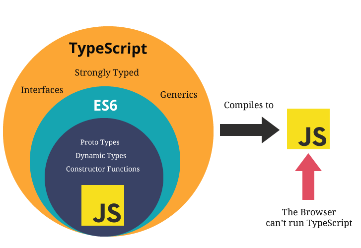

# Class

在`ES6`中已经存在的特性不做多说，来讲一讲`typescript`新实现的东西：

## 属性约束

### 公共，私有与受保护的修饰符

**默认为 `public`**

 在TypeScript里，成员都默认为 `public`，你也可以明确的将一个成员标记成 `public`。

```ts
class Animal {
    public name: string;
    public constructor(theName: string) { this.name = theName; }
    public move(distanceInMeters: number) {
        console.log(`${this.name} moved ${distanceInMeters}m.`);
    }
}
```

**理解 `private`**

当成员被标记成 `private`时，它就不能在声明它的类的外部访问。比如：

```ts
class Animal {
    private _name: string;
    constructor(theName: string) { this._name = theName; }
}

new Animal("Cat")._name; // 错误: 'name' 是私有的.
```

**理解 `protected`**

`protected`修饰符与 `private`修饰符的行为很相似，但有一点不同， `protected`成员在派生类中仍然可以访问。例如：

```ts
class Person {
    protected name: string;
    constructor(name: string) { this.name = name; }
}

class Employee extends Person {
    private department: string;

    constructor(name: string, department: string) {
        super(name)
        this.department = department;
    }

    public getElevatorPitch() {
        return `Hello, my name is ${this.name} and I work in ${this.department}.`;
    }
}

let howard = new Employee("Howard", "Sales");
console.log(howard.getElevatorPitch());
console.log(howard.name); // 错误
```

构造函数也可以被标记成 `protected`。 这意味着这个类不能在包含它的类外被实例化，但是能被继承。比如，

```ts
class Person {
    protected name: string;
    protected constructor(theName: string) { this.name = theName; }
}

// Employee 能够继承 Person
class Employee extends Person {
    private department: string;

    constructor(name: string, department: string) {
        super(name);
        this.department = department;
    }

    public getElevatorPitch() {
        return `Hello, my name is ${this.name} and I work in ${this.department}.`;
    }
}

let howard = new Employee("Howard", "Sales");
let john = new Person("John"); // 错误: 'Person' 的构造函数是被保护的.
```

### readonly修饰符

你可以使用 `readonly`关键字将属性设置为只读的。 只读属性必须在声明时或构造函数里被初始化。

```ts
class Octopus {
    readonly name: string;
    readonly numberOfLegs: number = 8;
    constructor (theName: string) {
        this.name = theName;
    }
}
let dad = new Octopus("Man with the 8 strong legs");
dad.name = "Man with the 3-piece suit"; // 错误! name 是只读的.
```

### 静态属性

到目前为止，我们只讨论了类的实例成员，那些仅当类被实例化的时候才会被初始化的属性。 我们也可以创建类的静态成员，这些属性存在于类本身上面而不是类的实例上。 在这个例子里，我们使用 `static`定义 `origin`，因为它是所有网格都会用到的属性。 每个实例想要访问这个属性的时候，都要在 `origin`前面加上类名。 如同在实例属性上使用 `this.`前缀来访问属性一样，这里我们使用 `Grid.`来访问静态属性。

```ts
class HumanLike {
    static birthSpace = "earth";
}

console.log(HumanLike.birthSpace);
```

## 类型比较

TypeScript使用的是结构性类型系统。 当我们比较两种不同的类型时，并不在乎它们从何处而来，如果所有成员的类型都是兼容的，我们就认为它们的类型是兼容的，也就是说不同的类生成的实例的类型也可能是相同的。

```ts
class A {
	name: string;
}

class B {
	name: string;
}
let a = new A('a')
let b = new B('b')
a = b		// ok
```

然而，当我们比较带有 `private`或 `protected`成员的类型的时候，情况就不同了。 如果其中一个类型里包含一个 `private`成员，那么只有当另外一个类型中也存在这样一个 `private`成员， 并且它们都是**来自同一处声明**时，我们才认为这两个类型是兼容的。 对于 `protected`成员也使用这个规则。

```ts
class Animal {
    private name: string;
    constructor(theName: string) { this.name = theName; }
}

class Rhino extends Animal {
    constructor() { super("Rhino"); }
}

class Employee {
    private name: string;
    constructor(theName: string) { this.name = theName; }
}

let animal = new Animal("Goat");
let rhino = new Rhino();
let employee = new Employee("Bob");

animal = rhino;
animal = employee; // 错误: Animal 与 Employee 不兼容.
```

## 类类型？

当你在 `TypeScript` 里声明了一个类的时候，实际上同时声明了很多东西。 最重要的就是类的 **实例** 的类型。

这里，我们写了 `let greeter: Greeter`，意思是 `Greeter`类的实例的类型是 `Greeter`。 这对于用过其它面向对象语言的程序员来讲已经是老习惯了。

`let Greeter`将被赋值为构造函数。 当我们调用 `new`并执行了这个函数后，便会得到一个类的实例。 这个构造函数也包含了类的所有静态属性。 换个角度说，我们可以认为类具有 **实例部分**与 **静态部分**这两个部分。

```ts
class Greeter {
    greeting: string;
    constructor(message: string) {
        this.greeting = message;
    }
    greet() {
        return 'Hello, ' + this.greeting;
    }
}

let greeter: Greeter = new Greeter("world");
```

我们会惊奇的发现只要 `greeter` 符合 `Greeter` 实例部分的结构，不管是不是有构造函数创建的，他都是 `Greeter` 类型：

```ts
let greeter: Greeter = {
    greeting: 'name',
    greet() {
        return 'fuck';
    },
};
```

如果说我们想拿到类这个类型而不是类的实例的类型，可以通过下面的方式：

```ts
let greeterMaker: typeof Greeter = Greeter;
let greeter2: Greeter = new greeterMaker();
console.log(greeter2.greet());
```

我们创建了一个叫做 `greeterMaker`的变量。 这个变量保存了这个类或者说保存了类构造函数。 然后我们使用 `typeof Greeter`，意思是取Greeter类的类型，而不是实例的类型。 或者更确切的说，"告诉我 `Greeter`标识符的类型"，也就是构造函数的类型。 这个类型包含了类的所有静态成员和构造函数。 之后，就和前面一样，我们在 `greeterMaker`上使用 `new`，创建 `Greeter`的实例。

## 抽象类

抽象类做为其它派生类的基类使用。 它们一般不会直接被实例化。 不同于接口，抽象类可以包含成员的实现细节。 `abstract`关键字是用于定义抽象类和在抽象类内部定义抽象方法。

```ts
abstract class Animal {
    abstract makeSound(): void;
    move(): void {
        console.log('roaming the earch...');
    }
}
```

抽象类中的抽象方法不包含具体实现并且必须在派生类中实现。 抽象方法的语法与接口方法相似。 两者都是定义方法签名但不包含方法体。 然而，抽象方法必须包含 `abstract`关键字并且可以包含访问修饰符。

```ts
abstract class Department {

    constructor(public name: string) {
    }

    printName(): void {
        console.log('Department name: ' + this.name);
    }

    abstract printMeeting(): void; // 必须在派生类中实现
}

class AccountingDepartment extends Department {

    constructor() {
        super('Accounting and Auditing'); // 在派生类的构造函数中必须调用 super()
    }

    printMeeting(): void {
        console.log('The Accounting Department meets each Monday at 10am.');
    }

    generateReports(): void {
        console.log('Generating accounting reports...');
    }
}

let department: Department; // 允许创建一个对抽象类型的引用
department = new Department(); // 错误: 不能创建一个抽象类的实例
department = new AccountingDepartment(); // 允许对一个抽象子类进行实例化和赋值
department.printName();
department.printMeeting();
department.generateReports(); // 错误: 方法在声明的抽象类中不存在
```


