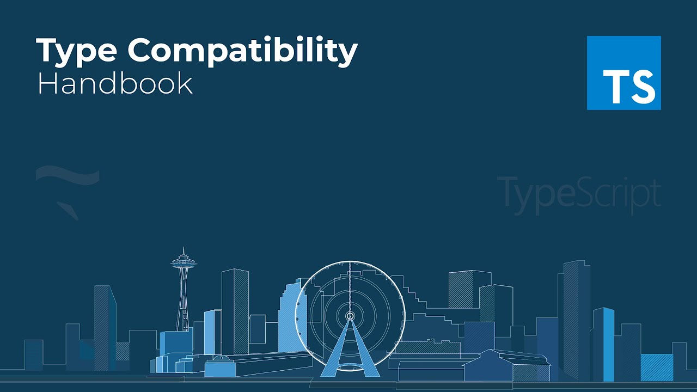

`TypeScript`里的类型兼容性是基于结构子类型的。 结构类型是一种只使用其成员来描述类型的方式。 它正好与名义`nominal`类型形成对比。

> **译者注：** 在基于名义类型的类型系统中，数据类型的兼容性或等价性是通过明确的声明和/或类型的名称来决定的。这与结构性类型系统不同，它是基于类型的组成结构，且不要求明确地声明。

## 对象兼容性

`TypeScript`结构化类型系统的基本规则是，如果`x`要兼容`y`，那么`y`至少具有与`x`相同的属性。这里要检查`y`是否能赋值给`x`，编译器检查`x`中的每个属性，看是否能在`y`中也找到对应属性。比如：

```ts
interface HumanLike {
    name: string;
}
class Human {
    name: string;
  	sex: string;
}

let man: HumanLike = new Human();
```

值得注意的是对字面量的检测更为严格，不能有多余的属性：

```ts
man = {
    name: "garbage",
    type: "non-recyclable",
}; 	// error
```

## 类

类与对象字面量和接口差不多，但有一点不同：类有静态部分和实例部分的类型。 比较两个类类型的对象时，只有实例的成员会被比较。 静态成员和构造函数不在比较的范围内。

```ts
class Animal {
    feet: number;
    constructor(name: string, numFeet: number) { }
}

class Size {
    feet: number;
    constructor(numFeet: number) { }
}

let a: Animal;
let s: Size;

a = s;  // OK
s = a;  // OK
```

#### 类的私有成员和受保护成员

类的私有成员和受保护成员会影响兼容性。 当检查类实例的兼容时，如果目标类型包含一个私有成员，那么源类型必须包含来自同一个类的这个私有成员。 同样地，这条规则也适用于包含受保护成员实例的类型检查。 这允许子类赋值给父类，但是不能赋值给其它有同样类型的类。

#### 类的静态成员和实例成员

转换到`Javascript`上说实例属性就是定义到原型链或者是实例化时产生的方法和属性，静态属性就是直接定义到构造函数上的属性和方法。静态属性的判定会被忽略，但是原型链上的属性不会被忽略。

```ts
class Human extends String {
    name: string;
}

class Dog {
    name: string;
}

let dog: Dog = new Human();
let human: Human = new Dog();		// error
```


## 函数兼容性

要查看`x`是否能赋值给`y`，首先看它们的参数列表。 `x`的每个参数必须能在`y`里找到对应类型的参数。 注意的是参数的名字相同与否无所谓，只看它们的类型和位置。 之所以这么设计是因为作者考虑到了`javascript`中参数省略的常用性。

```ts
let x = (a: number) => 0;
let y = (b: number, s: string) => 0;

y = x; // OK
x = y; // Error
```

对于返回值来说，类型系统强制源函数的返回值类型必须是目标函数返回值类型的子类型。

```ts
let x = () => ({name: 'Alice'});
let y = () => ({name: 'Alice', location: 'Seattle'});

x = y; // OK
y = x; // Error, because x() lacks a location property
```

#### 可选参数及剩余参数

比较函数兼容性的时候，可选参数与必须参数是可互换的。 源类型上有额外的可选参数不是错误，目标类型的可选参数在源类型里没有对应的参数也不是错误，当一个函数有剩余参数时，它被当做无限个可选参数。

有一个好的例子，常见的函数接收一个回调函数并用对于程序员来说是可预知的参数但对类型系统来说是不确定的参数来调用：

```ts
function invokeLater(args: any[], callback: (...args: any[]) => void) {
    /* ... Invoke callback with 'args' ... */
}

// Unsound - invokeLater "might" provide any number of arguments
invokeLater([1, 2], (x, y) => console.log(x + ', ' + y));

// Confusing (x and y are actually required) and undiscoverable
invokeLater([1, 2], (x?, y?) => console.log(x + ', ' + y));
```

## 枚举

枚举类型与数字类型兼容，并且数字类型与枚举类型兼容。不同枚举类型之间是不兼容的。比如，

```ts
enum Status { Ready, Waiting };
enum Color { Red, Blue, Green };

let status = Status.Ready;
status = Color.Green;  // Error
```

## 泛型

对于没指定泛型类型的泛型参数时，会把所有泛型参数当成`any`比较。 然后用结果类型进行比较。比如，

```ts
interface Empty<T> {
}
let x: Empty<number>;
let y: Empty<string>;

x = y;  // OK, because y matches structure of x
```

`x`和`y`是兼容的，因为它们的结构使用类型参数时并没有什么不同。 把这个例子改变一下，增加一个成员，就能看出是如何工作的了，在这里，泛型类型在使用时就好比不是一个泛型类型

```ts
interface NotEmpty<T> {
    data: T;
}
let x: NotEmpty<number>;
let y: NotEmpty<string>;

x = y;  // Error, because x and y are not compatible
```

