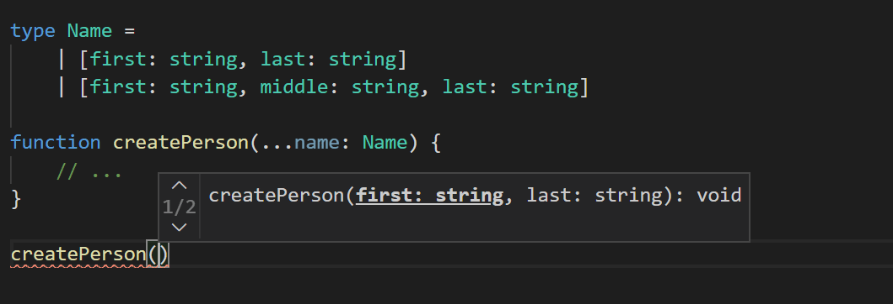

## 超载死亡

考虑一下JavaScript中的一个函数，该函数`concat`采用两个数组或元组类型并将它们连接在一起以创建一个新数组。

```ts
function concat(arr1, arr2) {
  return [...arr1, ...arr2];
}
```

还要`tail`，它接受一个数组或元组，并返回除第一个元素外的所有元素。

```ts
function tail(arg) {
  const [_, ...result] = arg;
  return result;
}
```

对于`concat`，我们在较旧版本的语言中唯一可以做的就是尝试编写一些重载。

```ts
function concat(arr1: [], arr2: []): [];
function concat<A>(arr1: [A], arr2: []): [A];
function concat<A, B>(arr1: [A, B], arr2: []): [A, B];
function concat<A, B, C>(arr1: [A, B, C], arr2: []): [A, B, C];
function concat<A, B, C, D>(arr1: [A, B, C, D], arr2: []): [A, B, C, D];
function concat<A, B, C, D, E>(arr1: [A, B, C, D, E], arr2: []): [A, B, C, D, E];
function concat<A, B, C, D, E, F>(arr1: [A, B, C, D, E, F], arr2: []): [A, B, C, D, E, F];)
```

嗯...好吧，这是第二个数组始终为空时的七个重载。让我们添加一些for when`arr2`有一个参数。

```ts
function concat<A2>(arr1: [], arr2: [A2]): [A2];
function concat<A1, A2>(arr1: [A1], arr2: [A2]): [A1, A2];
function concat<A1, B1, A2>(arr1: [A1, B1], arr2: [A2]): [A1, B1, A2];
function concat<A1, B1, C1, A2>(arr1: [A1, B1, C1], arr2: [A2]): [A1, B1, C1, A2];
function concat<A1, B1, C1, D1, A2>(arr1: [A1, B1, C1, D1], arr2: [A2]): [A1, B1, C1, D1, A2];
function concat<A1, B1, C1, D1, E1, A2>(arr1: [A1, B1, C1, D1, E1], arr2: [A2]): [A1, B1, C1, D1, E1, A2];
function concat<A1, B1, C1, D1, E1, F1, A2>(arr1: [A1, B1, C1, D1, E1, F1], arr2: [A2]): [A1, B1, C1, D1, E1, F1, A2];
```

这种情况，我们称其为“超载死亡(超过一千个重载)”，当然我们可以使用数组类型来解决这个问题：

```ts
function concat<T, U>(arr1: T[], arr2: U[]): Array<T | U>;
```

但是，当使用元组时，该签名不会对输入的长度或元素的顺序进行任何编码。

## 可变元组类型

在 `typescript4.0`  中可以使用使用泛型 `T` 代表元组类型并且可以使用 `...` 拓展操作符对元组(数组)类型进行操作，不过操作完的结果必须放回新的元组(和数组拓展的规则是一样的)，这样即使不知道元组内的具体类型我们也可以对元组进行高级操作：

```ts
type Arr = readonly any[];

function concat<T extends Arr, U extends Arr>(arr1: T, arr2: U): [...T, ...U] {
  return [...arr1, ...arr2];
}
```

> `T` 的类型其实是从参数中推断出来的，`extends Arr` 只是要求其接受一个数组。

### 规则

此外 `spread` 表达式时可以出现在元组的任何地方：

```ts
type Strings = [string, string];
type Numbers = [number, number];
type StrStrNumNumBool = [...Strings, ...Numbers, boolean];
```

当我们扩展到一个`spread`未知的类型时，结果类型也会变成无界的，并且下面的所有元素都将成为结果rest元素类型。

```ts
type Strings = [string, string];
type Numbers = number[];
type Unbounded = [...Strings, ...Numbers, boolean];
// type Unbounded = [string, string, ...number[], boolean]
```

用这两个高端操作我们就可以回去实现 `concat` 方法了：

### 栗子🌰

比如说下面的方法里面我们直接对传入的元组进行拆分实现 `tail` 方法：

```ts
function tail<T extends any[]>(arr: readonly [any, ...T]) {
  const [_ignored, ...rest] = arr;
  return rest;
}

const myTuple = [1, 2, 3, 4] as const;
const r1 = tail(myTuple);
//    ^ = const r1: [2, 3, 4]
```

## 标签元组类型

使用参数元组解构收集函数参数是一个很有趣的技巧：

```ts
function foo(...args: [string, number]): void {
  // ...
}
```

这样的一个函数的效果是这样的;

```ts
function foo(arg0: string, arg1: number): void {
  // ...
}

foo("hello", 42);
foo("hello", 42, true);
// Expected 2 arguments, but got 3.
foo("hello");
// Expected 2 arguments, but got 1.
```

但在一个地方，这样函数参数的名称就消失了，不可避免的可读性会下降。比如在第一个示例中，第一和第二个元素没有参数名：

这就是为什么在TypeScript 4.0中，元组类型现在可以提供标签了:

```ts
type Range = [start: number, end: number];
```

### 规则

在使用标记元组时有一些规则。首先，当标记一个元组元素时，该元组中的所有其他元素也必须被标记。

```ts
type Bar = [first: string, number];
// Tuple members must all have names or all not have names.
```

为了加深参数列表和元组类型之间的关系，rest元素和可选元素的语法反映了参数列表的语法。

```ts
type Foo = [first: number, second?: string, ...rest: any[]];
```

在解构时，标签并不要求我们对变量进行不同的命名。它们纯粹是为了文档和调试工具。

```ts
function foo(x: [first: string, second: number]) {
    // ...

    // note: we didn't need to name these 'first' and 'second'
    const [a, b] = x;
    a
//  ^ = const a: string
    b
//  ^ = const b: number
}

```

利用围绕元组和参数列表的模式以类型安全的方式实现重载时，`label` 元组很方便。事实上，`TypeScript`的编辑器支持会尽可能地将它们显示为重载。



